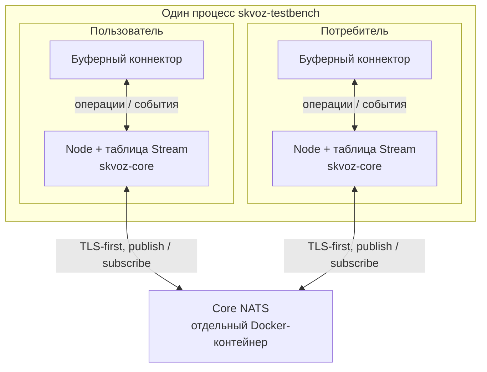
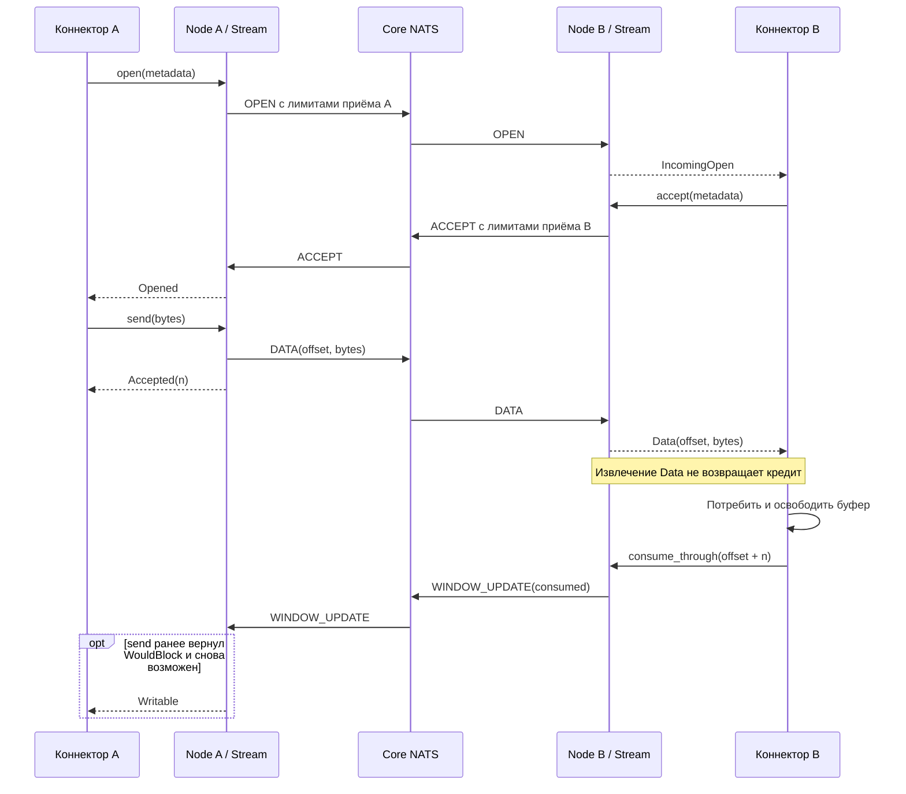
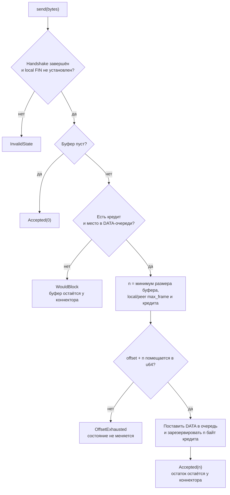

# Текущая архитектура

Документ описывает реализованные компоненты SKVOZ. Цели для production-узла,
клиентов и мобильных адаптеров находятся отдельно в [концепции](concept.md).

## Компоненты и границы

`skvoz-core` — библиотека Rust с движком одного потока и экспериментальным
codec. Движок не выполняет I/O и не выбирает async runtime. Он отвечает за
состояния, порядок байтов, кредит, ограниченные очереди и закрытие.

`skvoz-testbench` соединяет два экспериментальных `Node` через Core NATS.
Оба Node и их буферные коннекторы работают в одном процессе; брокер —
отдельный контейнер. Это текущая топология стенда:

Роли публикуют фреймы друг другу через разные inbox subjects:

| Роль Node | Публикация | Подписка |
| --- | --- | --- |
| Пользователь | Inbox потребителя | Inbox пользователя |
| Потребитель | Inbox пользователя | Inbox потребителя |

Каждый Node владеет одним NATS client, одной подпиской и таблицей потоков.
Потоки мультиплексируются поверх этих соединений. Драйвер кодирует исходящие
фреймы, публикует их по порядку, декодирует входящие и передаёт их нужному
`Stream`. Он также подаёт движкам монотонное время и обрабатывает потерю
транспорта. Все операции одного `Stream` требуют эксклюзивного mutable доступа.

Буферный коннектор в стенде создаёт и потребляет данные. Будущий внешний
коннектор будет владеть сокетом или другим I/O; устройство ядра не требует
знания HTTP, SOCKS или платформенного API этого коннектора.

## Открытие и возврат кредита

Обе стороны могут инициировать поток. Ниже один цикл для инициатора A и
принимающей стороны B; каждый транспортный фрейм проходит через NATS.
События извлекаются коннекторами, а входящие публикации — драйвером.

`send` принимает не больше одного фрейма за вызов и может принять только часть
переданного буфера. Принятые байты сразу резервируют кредит. Оставшуюся часть
хранит коннектор. `poll_events` передаёт буфер коннектору, но не подтверждает
потребление: кредит возвращает только `consume_through`.

Событие `Writable` может также возникнуть после освобождения места в исходящей
очереди. Драйвер вызывает `poll_frames`, чтобы извлечь фреймы; этот вызов
передаёт владение драйверу и ещё не означает доставку peer. NATS `flush`
подтверждает серверный барьер, а не потребление данных на стороне B.

## Решение об отправке

Схема ниже описывает `Stream.send` после открытия потока. В ней показаны
условия частичной отправки, backpressure и ошибки API.

Точные единицы, значения по умолчанию и границы определены в
[контракте движка](stream-engine.md), формат DATA — в [wire v1](wire.md).
Собственные очереди драйвера и коннектора также должны быть ограничены.

## EOF и аварийное закрытие

`finish` закрывает только локальное отправляющее направление. FIN извлекается
после ранее принятых DATA. Противоположная сторона может продолжать отправку,
в том числе ответ после EOF запроса.

Нормальное завершение требует обоих EOF, передачи локального FIN драйверу и
потребления всех входящих байтов. Ошибка протокола, отмена, opening timeout или
потеря транспорта закрывают поток аварийно и освобождают внутренние очереди.
Ранее переданные вызывающему буферы остаются у вызывающего.
[Диаграмма состояний и события](stream-engine.md) описывают эти переходы.

У Node есть конечное состояние отказа транспорта: после его применения
локальные потоки закрыты, и старый Node больше не открывает новые. Восстановление
соединения библиотекой NATS не возобновляет эти потоки.

## Изоляция и пределы реализации

Runner выдаёт двум ролям разные временные credentials. Каждая роль публикует
только в inbox peer и подписывается на свой inbox внутри namespace запуска.
CA, ключи и пароли создаются заново; NATS принимает TLS-first соединения.
Подробности запуска: [первый запуск](getting-started.md).

Эта схема не реализует произвольное discovery, production identity,
переиспользование закрытых stream slots, ротацию credentials, сквозное шифрование
или активный liveness/resumption. Потеря последней публикации при формально
живом транспорте требует отдельного механизма обнаружения. Границы очередей
не устанавливают полный предел RSS процесса и не являются измерением WAN,
пропускной способности или справедливости планирования.

Исходники: [Stream](../core/src/stream.rs), [типы](../core/src/types.rs),
[codec](../core/src/wire.rs), [Node](../testbench/src/node.rs),
[сценарии стенда](../testbench/src/scenarios.rs).
