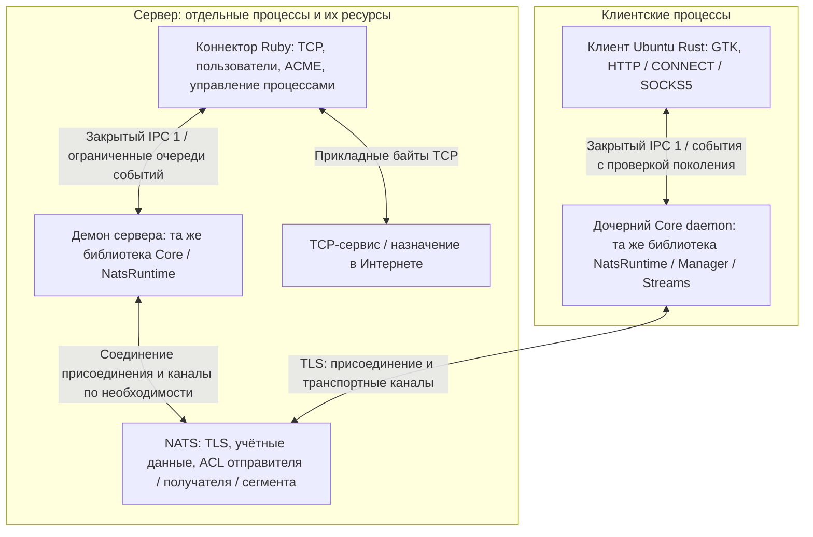
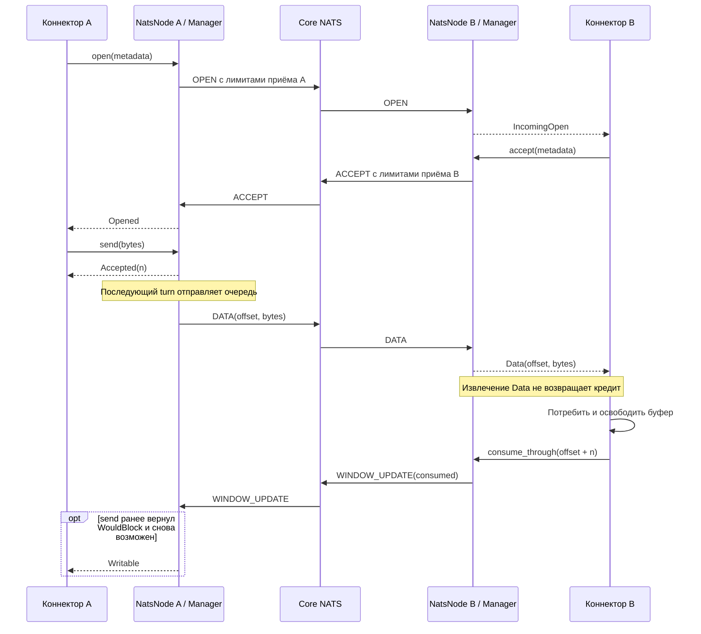
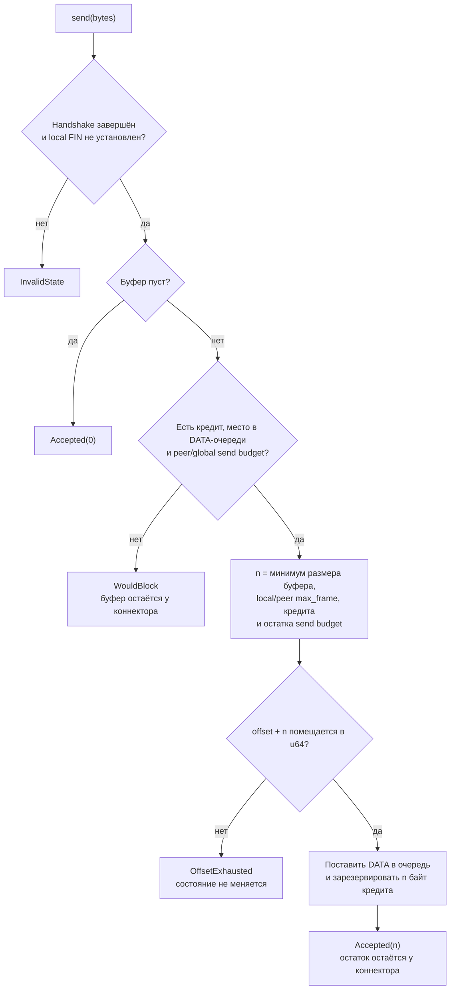

# Текущая архитектура

Документ описывает реализованные компоненты SKVOZ. Цели для рабочего серверного узла,
клиентов и мобильных адаптеров находятся отдельно в [концепции](concept.md).

## Компоненты и границы

`skvoz-core` — одна универсальная Rust-библиотека для любых коннекторов,
клиентских и серверных приложений. Stream, Manager и кодек не выполняют I/O;
опциональная возможность `nats` добавляет статический NatsNode и динамический
NatsRuntime на Tokio/async-nats. Роль приложения не меняет реализацию или контракт ядра.

[Серверный коннектор](server-connector.md) сейчас реализован на Ruby и управляет
отдельными процессами NATS и демона Core, выдаёт учётные данные пользователей
NATS и профили устройств, поддерживает жизненный цикл TLS. Через IPC он получает
метаданные назначения с версией формата и разбирает их, затем передаёт прикладные
байты TCP-сервисам, включая HTTP, без разбора прикладного протокола.
По умолчанию разрешены публичные адреса Интернета; явные правила доступа
позволяют строить мосты к частным и локальным сервисам.
Граница коннектора не зависит от языка и допускает другую реализацию в будущем.

[Клиент Ubuntu](ubuntu-client.md) — нативный Rust-процесс с GTK4/libadwaita и локальными HTTP/HTTPS CONNECT/SOCKS5 адаптерами. Он автоматически выделяет устройство через broker-authorized enrollment и управляет комплектным Core daemon через закрытый IPC; прикладной TLS CONNECT остаётся непрозрачными байтами.

Manager привязывает поток к `(PeerId, stream_id)`, при допуске резервирует всё
объявленное окно приёма, ограничивает число активных и закрывающихся потоков,
а также объём ожидающих DATA глобально и по участникам.
Буфер полезной нагрузки приёма выделяется только при DATA; у простаивающих
потоков его ёмкость равна нулю. Драйвер обслуживает очереди готовых потоков
и индекс сроков открытия; обычный цикл не просматривает все простаивающие потоки.

Динамический [NatsRuntime](nats-runtime.md) поддерживает аутентифицированное
присоединение и повторное присоединение, новые поколения после потери транспорта
и подтверждение готовности транспортного канала через PING/PONG.
Он использует одно соединение присоединения и ограниченное число транспортных
сегментов, создаваемых по необходимости, без отдельной задачи на каждый поток.
`qualify` запускает отдельные серверные и клиентские процессы сборки release;
перегрузка канала закрывает его участников, а остальные сегменты продолжают работу.

В прежнем многоклиентском стенде `load` все клиентские и серверные приложения
находятся в одном процессе, а брокер — в отдельном контейнере.
При развёртывании приложения могут находиться на разных машинах.
Серверное приложение со встроенным Core и NATS могут делить одну машину
и её ресурсы. Стенд не доказывает ёмкость такой машины.

Каждый NatsNode владеет одним NATS client и одной подпиской, без отдельного
соединения или задачи на logical stream. Host задаёт явный список доверенных
peer identities и session generations. Subjects имеют вид
`<namespace>.<recipient>.<recipient-session>.<sender>.<sender-session>`.
NatsNode подписывается на свой recipient/session с wildcard sender и проверяет
точную зарегистрированную пару sender/session до передачи в Manager.
Credentials/ACL брокера должны связывать sender identity с разрешёнными
recipient subjects; session token сам по себе не является аутентификацией.

API коннектора синхронно ставит bounded work. `turn(wait)` кодирует и публикует
не больше настроенного числа фреймов, принимает bounded input batch и подаёт
монотонное время менеджеру. Flush выполняется на batch, а не на каждый send.
Будущий вызов turn обязателен для передачи enqueue операций. `flush_pending`
передаёт bounded output batch без чтения inbound. Поллинг событий также обязан
продолжаться, чтобы освободить terminal entries.

`connectors/tcp` владеет одним сокетом и выдаваемыми Core буферами. Реальный
TCP пример создаёт два выделенных NatsNode того же Core, локальный requester
и удалённый target. Он проверяет bytes/FIN/ответ после EOF. Для many-socket proxy
нужен connector dispatcher; текущий relay не является таким proxy.

## Отдельный процесс ядра Core

[Демон](daemon-ipc.md) встраивает тот же NatsRuntime и управляет циклом
обслуживания транспорта и событий. Приложение на другом языке передаёт
байты и метаданные фреймами через закрытый Unix-сокет.
Сессия IPC владеет дескрипторами потоков; входящие OPEN назначаются одному
эксклюзивному получателю. Другие локальные сессии открывают исходящие потоки.
Полная запись DATA продвигает только отметку доставки через IPC;
реальный кредит возвращает коннектор через CONSUME после обработки байтов.
Медленный владелец или владелец с переполненной очередью отменяется отдельно,
в том числе среди владельцев одного участника NATS.

Закрытый родительский каталог с правами `0700`, сокет с правами `0600`
и проверка UID участников ограничивают доступ локальным пользователем ОС.
Это не защищает от других произвольных процессов того же UID,
не распределяет входящие потоки автоматически между коннекторами
и не выдаёт сетевые учётные данные.

## Открытие и возврат кредита

Обе стороны могут инициировать поток. Ниже один цикл для инициатора A и
принимающей стороны B; каждый транспортный фрейм проходит через NATS.
События извлекаются коннекторами, а входящие публикации — драйвером.

`send` принимает не больше одного фрейма за вызов и может принять только часть
переданного буфера. Принятые байты сразу резервируют кредит. Оставшуюся часть
хранит коннектор. `poll_events` передаёт буфер коннектору, но не подтверждает
потребление: кредит возвращает только `consume_through`.

Событие `Writable` может также возникнуть после освобождения места в исходящей
очереди. Драйвер вызывает `poll_frames`, чтобы извлечь фреймы; этот вызов
передаёт владение драйверу и ещё не означает доставку peer. NATS `flush`
завершает локальную запись socket buffers; он не подтверждает broker-installed
subscriptions или потребление данных B. Динамический runtime подтверждает готовность
lane настоящим matching PING/PONG.

## Решение об отправке

Схема ниже описывает `Manager.send` поверх `Stream.send` после открытия потока. В ней показаны
условия частичной отправки, backpressure и ошибки API.

Точные единицы, значения по умолчанию и границы определены в
[контракте движка](stream-engine.md), формат DATA — в [wire v1](wire.md).
Собственные очереди драйвера и коннектора также должны быть ограничены.

## EOF и аварийное закрытие

`finish` закрывает только локальное отправляющее направление. FIN извлекается
после ранее принятых DATA. Противоположная сторона может продолжать отправку,
в том числе ответ после EOF запроса.

Нормальное завершение требует обоих EOF, передачи локального FIN драйверу и
потребления всех входящих байтов. Manager удаляет terminal entry и освобождает
receive reservation только после выдачи всех terminal frames/events. Числовой
ID в той же peer session повторно не используется; новые monotonic IDs могут
занять освобождённые slots. Ошибка протокола, отмена, opening timeout или
потеря транспорта закрывают поток аварийно и освобождают внутренние очереди.
Ранее переданные вызывающему буферы остаются у вызывающего.
[Диаграмма состояний и события](stream-engine.md) описывают эти переходы.

У Node есть конечное состояние отказа транспорта: после его применения
локальные потоки закрыты, и старый Node больше не открывает новые. Восстановление
соединения библиотекой NATS не возобновляет эти потоки.

## Изоляция и пределы реализации

Runner выдаёт раздельные временные credentials обычным runtime/TCP участникам.
Daemon qualification также проверяет два provisioned device PeerId с общим login
и явно ограниченным ACL набором; credential не изолирует эти две identities друг от друга. CA, ключи и пароли создаются заново; NATS принимает TLS-first соединения.
Подробности: [первый запуск](getting-started.md).

Round-robin выдаёт один frame на ready peer, вращая streams внутри peer.
Ограниченные send budgets защищают admission/очереди; frame fairness не является
byte fairness или гарантией p99 latency. Полная receive reservation сохраняется
до terminal cleanup, включая выданные коннектору непотреблённые данные. Малое
окно экономит обещанный receive budget, но может ограничить throughput при RTT.

Disconnect/SlowConsumer/server/client error навсегда защёлкивает отказ NatsNode.
Следующий owner API/turn/poll применяет transport_lost; восстановление соединения
async-nats не восстанавливает потоки. `peer_lost` закрывает только заданного peer.
Отмена turn/flush_pending при передаче output защёлкивает ClientError, поскольку
извлечённый frame нельзя безопасно вернуть в ordered очередь. Следующий owner
API/poll закрывает node; idle input wait можно отменять без этого отказа.
Статические routes не обновляются во время работы: смена session generation
клиента требует пересоздания/перенастройки принимающего node. Старые recipient
subjects не доставляются новой subscription; stale sender session игнорируется.
Эти ограничения относятся к статическому NatsNode. Динамический NatsRuntime
поддерживает authenticated join/rejoin и bounded recovery для новых streams;
transparent byte resumption не реализовано.

Статический NatsNode не обнаруживает тихий исчезнувший peer или потерю последней
публикации. NatsRuntime обнаруживает их nonce heartbeat и applied-frame watermark. Логические byte counters не включают
накладные расходы выделения памяти, удерживаемые приложением фреймы и события, очереди коннектора,
NATS/TLS/runtime buffers или broker. RSS нагрузки включает все clients и server
в одном процессе; ограничения контейнера относятся только к брокеру. Короткий
loopback эксперимент не доказывает WAN, mobile или whole-machine SLA.

Исходники: [Stream](../core/src/stream.rs), [Manager](../core/src/manager.rs),
[codec](../core/src/wire.rs), [NatsNode](../core/src/nats.rs),
[NatsRuntime](../core/src/runtime.rs),
[daemon](../daemon/src/driver.rs), [IPC protocol](../daemon/src/protocol.rs),
[TCP relay](../connectors/tcp/src/lib.rs), [нагрузка](../testbench/src/mesh.rs).
