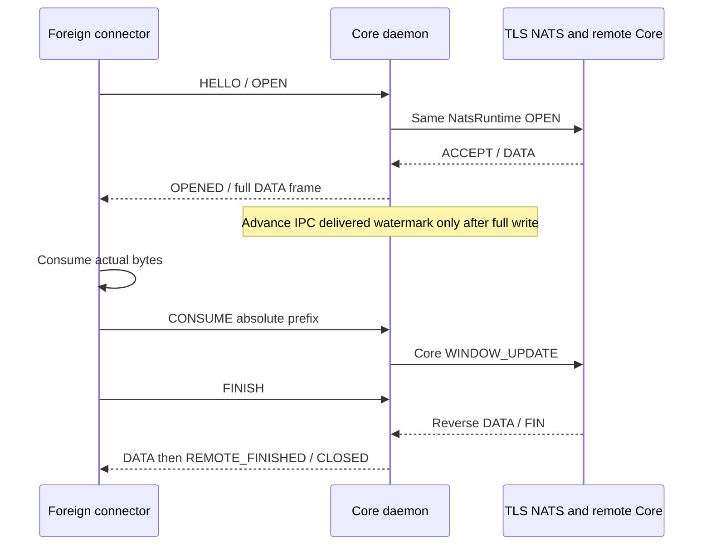

# Core daemon и локальный IPC v1

Этот контракт описывает runnable Linux executable `skvoz-core-daemon`1.4.0.
Он встраивает ту же [универсальную Core library/NatsRuntime](nats-runtime.md),
которую можно использовать из Rust. Python/Ruby/другие host languages общаются
через pathname Unix socket; отдельного client/server Core или native bindings нет.
Первый qualification target — Linux x86_64; другие OS/CPU здесь не квалифицированы.

## Сборка, запуск и профиль

Из корня:

```sh
cargo build --release -p skvoz-daemon --locked
./target/release/skvoz-core-daemon --help
./target/release/skvoz-core-daemon --version
python3 testbench/run.py daemon
```

Runner запускает независимые release daemons, Python acceptor и Python/Ruby
binary clients через NATS с закреплённым образом и TLS и временными CA/паролями/ACL. Нужны
Linux, Rust1.92+, Python3.9+, Ruby3.4+, Docker/OpenSSL. Для cached dependencies/image
добавьте `--offline`. `check` включает этот же сценарий после остальных проверок.
Dependencies и image digest закреплены в Cargo.lock и runner; IPCv1 отличается
от experimental network wire/control v1.

Для собственного NATS provisioner создаёт profile JSON. Храните его в отдельном
private runtime directory вне checkout, например созданном `mktemp -d`; mode0700
directory и0600 profile. Профиль/CA/socket являются runtime output и не входят
в исходники. Создайте runtime directory и определите переменную для provisioned profile:

```sh
SKVOZ_RUN=$(mktemp -d)
SKVOZ_PROFILE="$SKVOZ_RUN/profile.json"
```

Provisioner записывает туда приведённую ниже схему с реальными значениями, mode0600.
Пример схемы с placeholders:

```json
{
  "ipc_path": "<private-directory>/core.sock",
  "url": "tls://nats.example.org:4222",
  "trust": "system",
  "username": "<provisioned-login>",
  "password": "<provisioned-password>",
  "namespace": "skvoz.application",
  "peer_id": 1,
  "allowed_peers": [0],
  "initiate": [0]
}
```

`ipc_path` и profile path должны быть absolute; подставьте directory из собственного
runtime environment. `trust: "managed_ca"` дополнительно требует `ca_file` с private
PEM bundle. `broker_authorized: true` заменяет непустой `allowed_peers`, доверяя
broker ACL в пределах admission. `initiate` опционален. Другие optional поля только
`limits`, описанный ниже; неизвестные ключи/type/range ошибки отвергаются.
PeerId/namespace/ACL/profile выдаёт host provisioner. IPC не меняет authenticated
network identity. Один login может обслуживать несколько explicitly provisioned
PeerId; ACL разрешает необходимый набор identities. Владелец общей credential
имеет права всего этого набора, отдельный device revoke/изоляция требуют отдельного
provisioning. Automatic device-ID allocation/credential issuance здесь отсутствуют.

```sh
./target/release/skvoz-core-daemon --check-config "$SKVOZ_PROFILE"
./target/release/skvoz-core-daemon --config "$SKVOZ_PROFILE"
```

`--check-config` проверяет shape/types/limits, safe IPC path/parent и runtime
profile без network/bind; occupied path и broker compatibility проверяются при
запуске. Profile имеет hard read limit16384bytes; CA <=1048576bytes при проверке.
Оба — owned private regular files (0400/0600), без symlink, с private0700 parent;
opened FD metadata/inode проверяются перед чтением, reads bounded max+1.
Runtime затем открывает проверенный CA path: same-UID host обязан не заменять/растить
trusted CA во время загрузки. Нет secret args/env/Debug/logs; ошибки фиксированные,
endpoint/пароль не выводятся. URL с embedded credentials запрещён.

Daemon резервирует socket до NATS connect, поэтому duplicate endpoint не запускает
смену network generation. После connect выводит `READY ipc=1`: broker connection
готова, peer readiness отдельно через PEER. SIGINT/SIGTERM прекращает admission,
отменяет streams, дренирует runtime и завершает его под одним конечным timeout,
выводит `STOPPED ipc=1`. Обычный runtime turn намеренно не отменяется:
IPC deadline checks и signals обрабатываются между turns. In-flight NATS
I/O/connection turn может задержать наблюдение; hard command/signal latency
не гарантируется. `shutdown_timeout_ms` ограничивает teardown после наблюдения stop. Exit0 graceful,2 config/endpoint/arguments,3 initial runtime
connect (safe TLS/auth category),4 terminal/internal runtime failure. Полная
terminal teardown отменяется только на окончательном drop, runtime не переиспользуется.

## Запуск из серверного коннектора

Host знает один настроенный `ipc_path`; искать процесс по имени не требуется.
Daemon может запускаться отдельной service или child process connector host с
argv `--config` и private profile pathname. Процессы используют общий filesystem
pathname и тот же UID. Host ждёт `READY ipc=1` либо успешный IPC HELLO, затем
дренирует events и отдельно проверяет PEER. READY означает broker/runtime startup,
а не remote target readiness. stdout содержит lifecycle notices; протокол идёт
только через socket, не stdin/stdout.

При child mode host наблюдает exit, завершает child через SIGTERM и ждёт его exit.
После child restart новый IPC session получает новые handles; старые streams/data
не возвращаются. Полноценный server launcher/Compose/user CLI, automatic profile
issuance и HTTP/SOCKS destination connector здесь не поставляются.

## Закрытая точка IPC и владельцы

Pathname socket absolute, <=100encoded bytes, parent already owned0700, без
symlink в компонентах; socket0600. Ancestor directories принадлежат root или
тому же UID; group/other writable ancestor допускается только со sticky bit,
который предотвращает rename private child другим пользователем. Effective UID берётся из собственного socketpair
peer credentials; accepted connection UID должен совпасть. Linux filesystem
permissions и SO_PEERCRED образуют user boundary. Same UID/root доверены как OS
principal: это не sandbox между процессами одного пользователя. Разные accepted
IPC sessions всё равно не могут оперировать чужими stream handles.

Любой existing endpoint — live/stale socket, regular file или symlink — вызывает
ошибку; daemon ничего не перехватывает и не удаляет. После crash host сначала
подтверждает отсутствие старого процесса, затем явно удаляет stale socket. Normal
cleanup удаляет только собственный dev/inode; чужая replacement path сохраняется.
Нет public TCP/abstract socket. Отправка shutdown через IPC не поддерживается.

Один local session может запросить exclusive incoming acceptor lease в HELLO;
остальные sessions открывают outbound streams. Incoming OPEN атомарно назначается
только текущему acceptor при свободном owner slot. При его отсутствии/переполнении
runtime отправляет bounded REJECT. Второй lease получает Admission. Lease
освобождается после disconnect; новый acceptor получает только будущие opens.
Daemon не разбирает destination metadata и не dispatches произвольные connector
типы. Это ответственность принимающего host.

## Бинарный формат и команды

Все integers big-endian, без padding. Outer u32 length исключает4bytes самого
prefix и включает body. Valid body32..65568bytes; size проверяется до allocation.
Заголовок тела занимает 32 байта:

| Поле | Размер |
| --- | --- |
| magic `SKI1` | 4 |
| version=1 | u16 |
| kind | u16 |
| request_id | u64 |
| handle | u128 |
| operation payload | 0..65536 raw bytes |

Частичные reads/writes сохраняют progress. Неверные size/magic/header version,
unknown command kind, EOF в partial frame и request replay закрывают только IPC
owner. Версия1 fixed schema; новые major versions требуют явного negotiation и
новой спецификации. Client обязан отвергать неизвестные версии/events.
Публичные [контрольные векторы](../daemon/tests/fixtures/README.md),
[модуль Python](../clients/python/skvoz_ipc.py), [модуль Ruby](../clients/ruby/skvoz_ipc.rb).

Первый command HELLO; request_id nonzero и строго возрастает для всех commands.
События имеют request0. Handle0 для session/peer commands, nonzero для stream
commands. После command response могут приходить asynchronous events; client
должен их дренировать и не путать с reply.

| kind | Command | Payload |
| --- | --- | --- |
| 1 | HELLO | minimum version u16, maximum version u16, acceptor_requested u8(0/1) |
| 2 | OPEN | peer u64, metadata0..512bytes |
| 3 | ACCEPT | metadata0..512bytes |
| 4 | REJECT | reason0..512bytes |
| 5 | SEND | bytes0..65536 |
| 6 | CONSUME | absolute consumed end_offset u64 |
| 7 | FINISH | empty |
| 8 | CLOSE | empty |
| 9 | STATUS | empty |
| 10 | JOIN | peer u64 |
| 11 | PEER | peer u64 |

JOIN означает обеспечить negotiation; уже ready peer — no-op, поэтому другой
local owner не закрывает его текущие streams. Pending join идемпотентен. PEER
возвращает readiness, не admission/доступность target socket. Metadata opaque.
HELLO response/error можно повторить с новым request до исходного hello timeout,
например после освобождения acceptor lease; успешный HELLO повторно запрещён.

Ответ имеет kind `0x8000` и соответствующий запросу request_id;
полезная нагрузка — result_code u16, value u64 и extra.
OPEN возвращает новый handle в заголовке. У SEND value — длина принятого префикса;
у WouldBlock и ACK value равен 0. HELLO extra содержит согласованную версию u16,
ID сессии u64, эпоху демона u64, features u32=15
(duplex/consume/exclusive acceptor/status), затем шесть u32:
максимальный размер нагрузки, максимальный размер метаданных, окно приёма,
потоки на владельца, число выходных фреймов и выходные байты.
PEER extra — готовность u8. STATUS extra — жизненный цикл u8
(0Connecting,1Ready,2Recovering,3Failed,4ShuttingDown,5Closed), затем 12 u64:
владельцы, сопоставленные потоки, фреймы и байты в очереди, потоки runtime,
зарезервированные байты приёма, ожидающие отправки байты, активные участники,
слоты членства, соединения, отказы сегментов и тайм-ауты участников.
STATUS просматривает только ограниченный набор слотов владельцев;
подробные ресурсы Core не сканируются.

| Result code | Значение |
| --- | --- |
| 0 | Success |
| 1 | WouldBlock |
| 2 | InvalidRequest/configuration/authorization/state-manager request error |
| 3 | UnsupportedVersion (HELLO range) |
| 4 | UnknownHandle/stale runtime generation |
| 5 | Admission |
| 6 | PeerUnavailable |
| 7 | InvalidState |
| 8 | InvalidConsumption |
| 9 | RuntimeUnavailable/transport failure |
| 10 | ProtocolError |

Ошибки operation schema возвращают typed result; framing/replay ошибка закрывает
connection. Обновлённый profile требует нового daemon, не передачи credentials IPC.

## События, кредит и порядок завершения

| kind | Event | Payload |
| --- | --- | --- |
| 0x9001 | INCOMING | peer u64, metadata |
| 0x9002 | OPENED | metadata |
| 0x9003 | REJECTED | reason |
| 0x9004 | DATA | absolute offset u64, raw bytes |
| 0x9005 | WRITABLE | empty |
| 0x9006 | REMOTE_FINISHED | empty |
| 0x9007 | CLOSED | reason u16:1Finished,2Rejected,3Cancelled,4TransportLost,5ProtocolError,6OpenTimeout |

Handle — random daemon epoch64 + monotonic stream counter64, никогда не reused.
Mapping хранит local owner session и полный generation-safe RuntimeKey. Чужой,
retired или previous-daemon handle возвращает4, в том числе CLOSE/CONSUME. При
reconnect нет takeover старых streams/events/data. Sequence exhaustion отвергает
OPEN до runtime allocation.

SEND принимает максимум одного Core frame и может принять только часть payload.
Client хранит suffix и повторяет после WRITABLE/прогресса. DATA enqueue/write
не возвращает credit. Daemon продвигает delivered watermark только после полной
записи DATA IPC frame; CONSUME выше этого watermark запрещён. Это проверяемая
запись в local socket, а не доказательство внешнего приложения потребления.
Host подтверждает только действительно использованный contiguous prefix.

FINISH закрывает send direction, reverse reply остаётся возможен. CLOSED может
быть queued после последнего DATA и сразу retire mapping. Поэтому последний
CONSUME уже прочитанных bytes может вернуть4: terminal cleanup освободил stream,
acknowledgment не применён. DATA/events, уже помещённые в FIFO перед CLOSED,
доставляются в этом порядке при healthy connection. Ни клиент, ни daemon не
возобновляют прерванные bytes. CLOSE, owner EOF/protocol/timeout/overflow закрывают
его streams, удаляют IPC queues/lease, а runtime terminal events продолжают
дренироваться, даже когда stale key не допускает close.



## Бюджеты и отказ одного владельца

Все `limits` integers, units ниже. Неизвестные fields отвергаются. Default/max:

| Field | Default | Range / max |
| --- | --- | --- |
| owners | 16 | 1..64 |
| streams_per_owner | 64 | 1..1024 |
| output_frames | 256 | 1..4096 |
| output_bytes | 262144 | 143..8388608 |
| ipc_timeout_ms | 5000 | 50..60000 |
| shutdown_timeout_ms | 5000 | 100..60000 |
| peers | 128 | 1..512 |
| streams | 1024 | 1..8192 |
| streams_per_peer | 128 | 1..8192 |
| receive_window | 8192 | 1..1048576 |
| max_frame | 1024 | 1..32768 and <=receive_window |
| pending_frames | 8 | 1..64 |
| open_timeout_ms | 5000 | 100..60000 |
| receive_bytes | 8388608 | 1..536870912, >=receive_window |
| receive_bytes_per_peer | 1048576 | 1..67108864, >=receive_window |
| send_bytes | 2097152 | 1..67108864 |
| send_bytes_per_peer | 262144 | 1..8388608 |
| shards | 8 | 1..32, same profile across peers |
| subscription_frames | 128 | 1..65536 |
| join_frames | 128 | 1..65536 |
| nats_commands | 16 | 1..65536 |

Нативный клиент Ubuntu и серверный коннектор явно задают окно 1 МиБ и кадры
до 32 КиБ для WAN-передач. Общие defaults минимального профиля выше остаются
неизменными. Увеличение одного окна без согласованных байтовых бюджетов и
очередей событий может привести к отказу в допуске или переполнению владельца.
Объявленное окно резервируется в `receive_bytes` и `receive_bytes_per_peer`;
бюджеты продолжают ограничивать число одновременно допущенных потоков.
Кадры DATA также содержат 8 байт смещения и должны помещаться в IPC payload.

Выделенные выходные фреймы учитываются и в количестве, и в байтах,
включая частично записанные фреймы; счётчики освобождаются только после полной
записи. У каждого владельца не больше одного входного тела на 65 568 байт
и префикса на 4 байта; за проход выполняются одна команда и запись до 16 КиБ.
Пакет событий runtime ограничен 128 событиями; обычный цикл без работы ждёт
2 мс, активный — передаёт управление планировщику. HELLO, частичный фрейм
и запись без прогресса имеют конечный срок; здоровая простаивающая сессия не истекает.
Выходная ёмкость 143 байта гарантирует место для обязательного фрейма STATUS
на 143 байта. DATA или событие метаданных больше выбранного лимита отменяет владельца.

Верхняя граница выделяемой полезной нагрузки IPC:
`owners*(output_bytes+65572)`, плюс одно тело команды не больше 65 568 байт,
один временный закодированный фрейм не больше 65 572 байт,
до 128 полезных нагрузок событий размером `max(max_frame,512)`
и текущие кодируемые событие и ответ не больше 65 572 байт каждый.
Это консервативная граница памяти для байтов полезной нагрузки, а не RSS:
заголовки контейнеров, выделения BTree/VecDeque/узлов, запас аллокатора,
буферы TLS/Tokio/ядра ОС и базовая память учитываются отдельно.
Настроенная граница транспортной нагрузки runtime и бюджеты приёма/отправки
Manager из [контракта runtime](nats-runtime.md) также конечны
и не включены в формулу IPC.

Overflow/timeout закрывает только local IPC owner, никогда не terminate_peer:
другой owner на том же peer сохраняет eligibility/progress. Большой owner не
заставляет daemon ждать его IPC write. NATS lane/global broker failures сохраняют
свою documented shared failure scope. Very small output profile может отказаться
от traffic burst даже у читающего client; это явный finite admission budget.
No RSS/throughput/p99/whole-host guarantee выводится из local qualification.

Квалификация включает real nonreading owner64streams при4096bytes/4frames,
независимый healthy owner на том же peer, actual queued-DATA watermark refusal,
credit stall8192 и prefix-resume, daemon/client kill и broker restart. Для
queued-delivery proof отдельный bounded profile использует streams/owner128,
output1MiB/2048frames; default64 incoming limit и отдельная tiny-queue failure
не скрываются повышением cap. Foreign helpers имеют собственные4096events/8MiB
queues; эти caller budgets не входят в daemon counters.

## Проверка сертификата при отдельном адресе подключения

Необязательный параметр профиля `tls_server_name` задаёт доменное имя в ASCII
или IP-адрес без скобок.
URL по-прежнему выбирает адрес подключения, а TLS проверяет явно заданное
имя или IP-адрес в SAN сертификата с настроенными корнями доверия.
Без этого параметра, как и раньше, проверяется имя из URL.
Штатная проверка WebPKI сохраняет проверку цепочки, срока действия
и подписей при установлении соединения. Параметр не меняет SNI из URL
и не добавляет маршрутизацию TLS по виртуальным хостам.

[Серверный коннектор](server-connector.md) использует эту возможность
для защищённого подключения к NATS через loopback с проверкой публичного
имени или IP-адреса сертификата. Подробности — в
[контракте доверия runtime](nats-runtime.md).

## Профиль транспорта

Демон использует общий [профиль NATS runtime](nats-runtime.md#профиль-транспорта).
Параметры доверия задаются в закрытом профиле; IPC остаётся v1.
