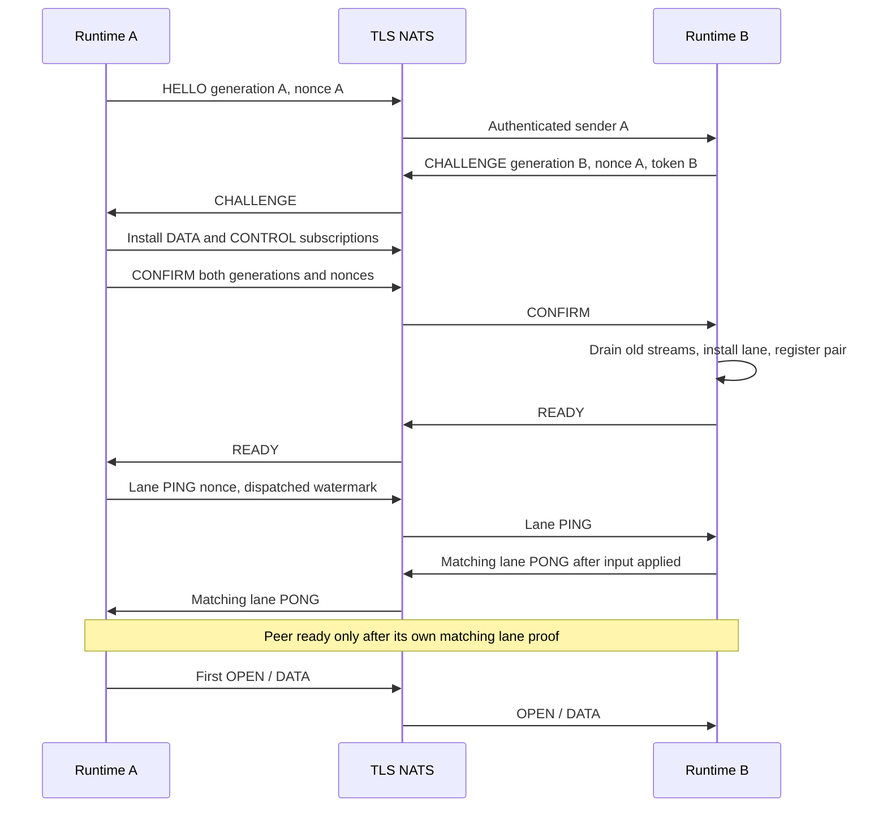

# Динамический NATS runtime

`skvoz_core::runtime::NatsRuntime` — опциональный runtime одной универсальной
Core library. Он добавляет authenticated join, смену peer session, проверку
живости и восстановление транспорта для новых byte streams. Включается feature
`nats`; HTTP/SOCKS parsing, DNS, сокеты, GUI и выдача credentials принадлежат host.
Статический [NatsNode](../core/src/nats.rs) остаётся совместимым с простым TCP
relay и прежними экспериментами. У него нет автоматического join/recovery.

## Подключение из приложения

```rust
use skvoz_core::{Config, ManagerConfig, PeerId};
use skvoz_core::runtime::{Authentication, Membership, NatsRuntime, RuntimeConfig, Trust};
use std::collections::BTreeSet;

async fn connect() -> Result<NatsRuntime, Box<dyn std::error::Error>> {
    let auth = Authentication {
        username: std::env::var("NATS_USERNAME")?,
        password: std::env::var("NATS_PASSWORD")?,
};
let mut config = RuntimeConfig::new(
    "tls://nats.example.org:4222", Trust::System, auth,
    "skvoz.application", PeerId(1),
    Membership::Allowlist(BTreeSet::from([PeerId(0)])),
);
config.initiate = vec![PeerId(0)];
let limits = ManagerConfig {
    stream: Config { max_metadata: 512, ..ManagerConfig::default().stream },
    ..ManagerConfig::default()
};
Ok(NatsRuntime::connect(config, limits).await?)
}
```

Компилируемый пример встраивания: [runtime_profile.rs](../core/examples/runtime_profile.rs).
Приложение вызывает `turn` и извлекает события, прежде чем полагаться на `peer_ready`.
`RuntimeConfig::validate_profile(limits)` проверяет профиль без I/O и возвращает
настроенную границу транспортной нагрузки. [Отдельный демон с IPC](daemon-ipc.md)
использует тот же runtime для приложений на других языках.

`Trust::System` использует native trust store. `ManagedCa(PathBuf)` использует
проверенный app-specific PEM bundle, без глобальной установки корня.
Проверка цепочки, срока и hostname обязательна. Runtime принимает provisioned
username/password; JWT/NKey credentials в этом профиле не поддерживаются.
Передача профиля, хранение/отзыв credentials, первоначальное доверие и обновление
сертификата — обязанности provisioner/host. TLS не выдаёт сертификаты и не
позволяет доверять произвольному скачанному CA. URL с embedded userinfo запрещён;
Debug конфигурации и typed errors не раскрывают endpoint или пароль.

Core 3.0.0 использует единый порядок NATS `INFO → TLS → CONNECT` во всех
соединениях: join, transport lanes и восстановление. Открытым остаётся только
начальный `INFO` с метаданными брокера. Пароль и payload передаются после
проверенного TLS; `require_tls(true)` запрещает открытый транспорт.
Брокер должен отправлять `INFO` до TLS (`tls.handshake_first: false`).
TLS-first брокеры с этим runtime несовместимы: обновляйте конфигурацию брокера
вместе с Core. Переключателей и автоматического downgrade нет.

Core 1.3.0 добавил `RuntimeConfig.tls_server_name: Option<String>`
со значением `None` по умолчанию. Приложение может подключаться к
`tls://127.0.0.1:4222`, проверяя явно заданный публичный IP-адрес или домен
в SAN сертификата. Штатный `WebPkiServerVerifier` по-прежнему проверяет
цепочку сертификатов, срок действия, SAN и подписи при установлении соединения;
меняется только ожидаемое имя или IP-адрес. `System` загружает системные корни
и прекращает подключение при ошибке загрузки. `ManagedCa` проверяет доверие
только по переданным корням PEM; пустые, недоверенные или некорректные корни
приводят к отказу. В текущем async-nats 0.50 загрузка системных корней
выполняется также до применения собственной конфигурации TLS, поэтому
повреждённое системное хранилище может помешать даже режиму `ManagedCa`.
Это безопасный отказ без перехода к посторонним корням доверия.
Параметр не меняет SNI из URL и не добавляет маршрутизацию TLS
по виртуальным хостам. Без параметра сохраняется проверка имени из URL.
[Профили демона](daemon-ipc.md) предоставляют то же необязательное поле.

NATS должен объявлять `max_payload: 65588`: максимальный wire v1 packet 65564
bytes плюс runtime envelope 24 bytes. Runtime отвергает и меньший, и больший
лимит, чтобы count-bounded inbound queues имели конечную границу payload bytes.
При общем брокере этот профиль необходимо согласовать с другими приложениями.

## API коннектора

Обе стороны используют один интерфейс. Операции над потоком синхронно ставят
работу в ограниченные очереди; приложение обслуживает её через async `turn`.

| Задача приложения | Метод |
| --- | --- |
| Подключить runtime с профилем TLS/auth и лимитами | `NatsRuntime::connect(config, limits).await` |
| Начать соединение с разрешённым peer / проверить его готовность | `join_peer(peer)` / `peer_ready(peer)` |
| Открыть поток, передав непрозрачные metadata назначения | `open(peer, metadata)` → `RuntimeKey` |
| Принять или отклонить входящий поток | `accept(key, metadata)` / `reject(key, reason)` |
| Поставить байты на отправку | `send(key, bytes)` → `Accepted(n)` или `WouldBlock` |
| Получить события потока | `poll_events(max)` → `Vec<RuntimeEvent>` |
| Подтвердить обработку полученных байтов | `consume_through(key, end_offset)` |
| Завершить отправляющее направление / отменить поток | `finish(key)` / `close(key)` |
| Обслужить транспорт, negotiation и таймеры | `turn(wait).await` |
| Получить состояние / подробные данные о буферах | `status()` / `resources()` |
| Завершить peer / отозвать его локальное разрешение | `terminate_peer(peer)` / `revoke_peer(peer)` |
| Завершить работу runtime | `shutdown().await` |

`RuntimeEvent` содержит ключ и событие, например `IncomingOpen`, `Opened`, `Data`,
`Writable`, `RemoteFinished` или `Closed`. После `IncomingOpen` серверный коннектор
сам открывает целевой сокет и подтверждает поток через `accept`. Кодирование
адреса в metadata принадлежит коннекторам.

`Accepted(n)` может обозначать только часть предложенного буфера: остаток хранит
приложение. Получение `Data` не возвращает кредит. `consume_through` подтверждает
абсолютную конечную позицию действительно обработанных байтов. `finish` допускает
ответ второй стороны после EOF; `close` отменяет поток. Подробный byte-credit/EOF
контракт определён в [движке](stream-engine.md).

`join_peer` идемпотентен для pending flight. Для уже ready peer прямой Core API
начинает новую negotiation: подтверждённая pair session replacement закрывает
старые streams. Host не должен считать повторный `join_peer` harmless connect.
IPC JOIN, напротив, обеспечивает готовность и является no-op для ready peer,
чтобы другой local owner не прерывал текущий обмен.

## Provisioning и доверенная identity

Broker permissions должны связывать sender PeerId, recipient PeerId и shard.
Полученный subject без таких ACL не доказывает authenticated identity.
`Allowlist` дополнительно ограничивает принимаемые PeerId. `BrokerAuthorized`
разрешает новые broker-authorized identities в пределах `ManagerConfig.max_peers`,
включая pending joins. Это явный контракт доверия к provisioning брокера;
пересоздавать сервер для нового разрешённого клиента не требуется.

Темы NATS:

```text
<namespace>.join.<recipient>.<sender>
<namespace>.lane.<recipient>.<recipient-generation>.<shard>.data.<sender>.<sender-generation>
<namespace>.lane.<recipient>.<recipient-generation>.<shard>.control.<sender>.<sender-generation>
```

Все участники namespace используют один `shards` profile; shard вычисляется как
`sender PeerId % shards`. Например, при восьми shards, server PeerId0 и client
PeerId1 provisioner даёт клиенту publish только в `join.0.1` и
`lane.0.*.1.*.1.*`; server publish — в `join.*.0` и `lane.*.*.0.*.0.*`.
Subscribe разрешается только на собственный recipient, с необходимыми wildcard
для generations/shards/senders. Namespace prefix также ограничивается ACL.
У другого client нет права подменить sender1, читать recipient1 или публиковать
в чужой shard. Не выдавайте blanket publish/subscribe `>` и automatic reply
permissions, обходящие эту границу. В NATS пустой allow-list не означает deny-all;
для роли без полномочий нужен явный `deny: [">"]`.

Broker/operator входит в доверенную границу: payload не зашифрован отдельно
между Core instances. HTTPS внутри будущего CONNECT сохраняет собственный TLS.
Скомпрометированная/дублированная credential той же identity может заменить её
session; runtime не заменяет credential revocation.

## Join, замена и готовность

Control v1 — ровно 77 bytes: `SKC1`, kind u8, sender generation u128, recipient
generation u128, initiator nonce u128, pair token/challenge u128, watermark u64;
числа big-endian. Это отдельный экспериментальный envelope; stream wire v1 и
его [fixtures](../core/tests/fixtures/README.md) сохраняются.

Node generation, initiator nonce и responder challenge генерируются OS randomness.
HELLO инициирует CHALLENGE; CONFIRM связывает обе generations и оба challenges;
READY завершает negotiation. Responder challenge становится pair-session token.
Повтор текущей flight идемпотентен, pending handshake имеет finite deadline.
Если оба peer одновременно начинают join, выигрывает инициатор с меньшим PeerId.
Старый HELLO может вызвать только новый bounded challenge, но не смену активной
session. Старый CONFIRM/READY/PONG или DATA не проходят текущие bindings.

При подтверждённой замене runtime аварийно завершает старые streams, выдаёт
terminal events и ждёт их drain. Затем снимает старую Manager registration,
создаёт новую pair session и новый local incarnation. Сохранённый `RuntimeKey`
содержит `(node epoch, peer incarnation, StreamKey)`; старые send/consume/close
возвращают `StaleKey`, даже если новый wire stream ID совпал. Incarnation и frame
sequence проверяются на overflow. Ранее выданные buffers остаются у host.

`async-nats::Client.flush()` завершает локальную запись socket buffers; это не
broker PONG и не доказательство установленной subscription. После negotiation
peer остаётся неготовым до matching nonce PONG на новой lane. DATA SUB создаётся
до CONTROL SUB на той же connection; успешный lane roundtrip подтверждает путь.
Первый потерянный warmup PING/PONG повторяется без продления исходного deadline.
`peer_ready` и `open` требуют этого доказательства.



Host обязан регулярно вызывать `turn` и `poll_events`. Если terminal events не
дренированы за `terminal_drain_timeout`, runtime публикует
`TerminalDrainTimeout`, прекращает replacement flights и сохраняет ограниченную
старую terminal registration до drain. Он не выбрасывает уведомления и не
накапливает поколения. При global recovery такой stall переводит lifecycle в
`Failed`; при peer replacement другие peers могут продолжать работу.

## Liveness и recovery

DATA envelope содержит pair token u128 и последовательный frame sequence u64.
Разрыв sequence завершает peer. PING содержит nonce и число dispatched frames;
PONG разрешён только после применения всех входящих frames до watermark.
Ожидание DATA при опережающем CONTROL занимает один coalesced pending slot.
Это подтверждение применения входа, не потребления buffers коннектором.
Потерянный последний frame не маскируется живым брокером или lost overflow callback:
его watermark не подтверждается. Slow reader, который продолжает driving Core,
и полностью idle peer отвечают на heartbeat независимо от выдачи byte credit.

Missing PONG завершает peer после configured deadline. Наблюдаемый bound включает
heartbeat interval, peer timeout, bounded peer visitation и host driving/I/O delay.
Runtime не исполняется сам без host turns. Peer slots обслуживаются bounded
rotation; driver не сканирует все idle streams. Manager сохраняет indexed opening
deadlines. Heartbeats повторяют исходный nonce/watermark до исходного deadline.

Global join-transport loss переводит `Ready -> Recovering`: старый Manager
остаётся terminal, events дренируются, затем создаются новый Manager и generation.
Retries используют bounded exponential delay+jitter; после `max_retries` — `Failed`.
Authentication/authorization failure terminal; host должен исправить provisioning
и создать новое подключение. Брокер может быть ready при ещё неготовом peer:
проверяйте `peer_ready`, а не только lifecycle. Не возобновляются старые bytes.

`terminate_peer` завершает локальную session. `revoke_peer` запрещает будущий join
только для `Allowlist`; с `BrokerAuthorized` возвращает `Config`, потому что
broker credential revocation принадлежит provisioner. Ошибки разделены на Config,
Tls, Authentication/Authorization, Timeout, Admission, PeerUnavailable, StaleKey,
Transport/Protocol и безопасные Manager errors.

## Queues, изоляция и status

Одна join connection и до `shards` lazy lane connections, по DATA и CONTROL
subscription на lane. Default shards8, допустимо1..32; отсутствуют connection/task
на каждый stream. Клиент к server PeerId0 использует только shard0, сервер —
не больше eight lanes данного профиля. CONTROL имеет собственную queue, join —
отдельный входной budget. Incoming shards вращаются после каждого message.

SlowConsumer/ошибка lane завершает peers этой shard. Другие shards сохраняют
прогресс; isolation внутри одной shard не обещается. Контрольный flood,
credential-authorized unlimited publish или broker-global saturation требуют
операционных rate/account limits. Broker `max_pending`/`write_deadline` ограничивают
его очереди. Повышение queue capacity не заменяет loss detection и admission.

DATA output публикуется bounded batch и flush выполняется на затронутые
connections. Cancellation guard действует для всех extracted frames до завершения
всех batch flushes: отмена может консервативно завершить все touched shards.
Retryable heartbeat/control batches также имеют отдельные конечные slots.

`RuntimeConfig::new` задаёт capacities128 DATA/CONTROL,128 join,16 commands,
64 inbound messages на каждый DATA/CONTROL pass и32 output frames/turn.
Control work дополнительно посещает до32 peers/turn с максимум четырьмя flights/
heartbeat messages на посещение; join input имеет отдельный budget16. Capacities
допускаются1..65536, batches1..256, retry attempts1..1024; durations максимум24h.
Manager limits задаются отдельно, включая max peers и global/per-peer streams/
receive/send budgets. Metadata limit512 bytes подходит для bounded destination
profile с255-byte hostname; parser в Core не входит.

`status()` использует O(1) Manager aggregate и counters, показывает active peers,
membership slots (включая pending), connections/retries/last error. `peer_status`
даёт явную per-peer диагностику; token/nonce не являются authentication secrets.
`resources()` остаётся O(stream count) диагностикой buffer occupancy.
Configured transport bound считает только queued payload:
`(join_capacity + 2*shards*subscription_capacity + (shards+1)*client_capacity) * 65588`.
Это конечная верхняя граница payload queue slots, не RSS: headers, allocator,
TLS/socket/runtime buffers, broker queues и caller-owned buffers отдельно.

## Воспроизводимая квалификация

[Первый запуск](getting-started.md#независимые-процессы-runtime) описывает `check`
и `qualify`: реальные TLS/auth/ACL, restart/rejoin, silent peer, tiny-queue overflow,
replay/stale keys, credential revocation и native trust. Test-only
`fault-injection` включён только `skvoz-testbench/real-nats`; обычный `nats` и
release `qualify` его не включают. Lost final DATA и cancelled extraction tests
явно inject failure; они не доказывают реальную потерю async-nats callback.

Qualification запускает отдельный release server и client processes, измеряет
server/client applications и broker отдельно. Delay forwarder задерживает реальные
TLS bytes, но также pacing8KiB chunks; это не полная эмуляция WAN. Hold после
active transfer проверяет bounded idle/liveness soak, не непрерывный traffic soak.
Local runs не устанавливают users/throughput/latency, mobile или whole-host SLA.
