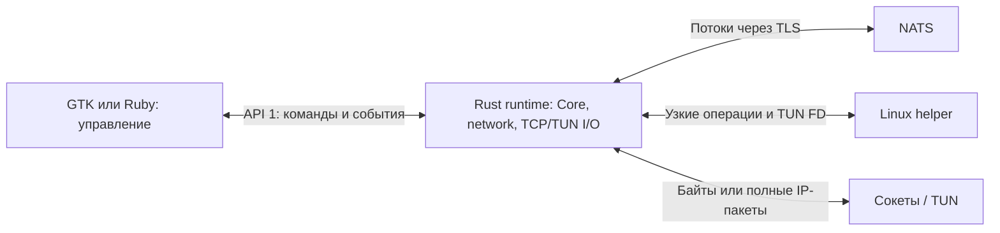

# Общий сетевой runtime

`skvoz-network` 0.1.0 связывает TCP-сокеты и полные IPv4/IPv6-пакеты с одной
реализацией [Core 3.1.0 / NatsRuntime](nats-runtime.md). Формат метаданных —
network 2, локальный API — 1. Это текущий контракт исходников; установка,
маршрутизация, изоляция в реальном окружении и производительность требуют
отдельной процессной и сетевой квалификации.

## Границы и поставка

Библиотека, `skvoz-network-runtime` и [FFI ABI 1](../network/ffi/README.md)
используют один actor и `NetworkEngine`. Ruby управляет серверными процессами,
пользователями и сертификатами; GTK управляет клиентским соединением и окном.
Прикладные байты и IP-пакеты проходят через Rust I/O, без сериализации в
управляющий JSON. Один runtime владеет одним Core, PeerId и диспетчером событий.
[Самостоятельный демон Core / IPC 1](daemon-ipc.md) сохраняет отдельное назначение.

Linux FD, TUN и `SCM_RIGHTS` вынесены в [native boundary](../network/native/README.md).
Основная библиотека и Core запрещают `unsafe`. Узкий
[helper](../network/helper/README.md) создаёт TUN и собственные маршруты,
правила firewall и настройки DNS. Он не принимает shell, скрипты, произвольные
команды или пути для удаления.



## Конфигурация и запуск

Сборка из корня:

```sh
cargo build --release --locked -p skvoz-network -p skvoz-network-helper --features skvoz-network/linux-runtime
target/release/skvoz-network-runtime --version
target/release/skvoz-network-helper --version
```

CLI runtime: `--config <private-json-file> --control-fd <fd>`; для IP-сервера
обязателен также `--helper-fd <fd>`. Родитель создаёт соединённую Unix socketpair,
передаёт только назначенные FD и закрывает свои копии после передачи владения.
`--help` и `--version` не подключаются к сети. Конфигурация содержит секреты,
ограничена 32 КиБ и читается из закрытого файла; launcher удаляет её после HELLO.

Корневой объект содержит ровно `v`, `role`, `core`, `network`, `server`.
`v=1`, роль `client` или `server`; у клиента `server=null`.
Все поля обязательны; неизвестные и повторные ключи отклоняются.
`core` задаёт `url`, `tls_server_name`, `trust`, `ca_file`, `username`, `password`,
`namespace`, `peer_id`, `membership`, `allowed_peers`, `initiate`.
Числовые PeerId записываются каноническими десятичными строками.
Клиент использует назначенный устройству PeerId и сервер `"0"`;
сервер использует `peer_id="0"` и `broker_authorized` membership.
Проверка доверия описана в [общем профиле транспорта](nats-runtime.md#профиль-транспорта).

`network` содержит `families`, `max_mtu`, `channels`, `limits`:
IPv4/IPv6 задаются `[4]`, `[6]`, `[4,6]`, MTU — 576–1500
(с IPv6 не менее 1280), каналов данных — 1–8. Только сервер без IP backend
может задать пустые семейства. Запрошенное недоступное семейство отклоняется
целиком, автоматического перехода на IPv4 нет.
Полный ресурсный профиль создаёт host; библиотечные типы и валидатор находятся
в `network/src/config.rs`. Настройки прежнего демона этим runtime не читаются.
Параметры gateway описаны в [руководстве сервера](server-connector.md#конфигурация-и-мосты-к-внутренним-сервисам).

## API 1 и дескрипторы

Сообщение — длина JSON в `u32be`, затем UTF-8 JSON до 32 768 байт:

```json
{"v":1,"id":1,"op":"HELLO","args":{"api":1,"network":2},"fd_count":0}
```

Ответ содержит ровно `{v,id,result,error,fd_count}`, событие —
`{v,seq,event,data,fd_count}`. При успехе `error=null`, при ошибке `result=null`.
ID команд возрастают от 1 до 2 147 483 647; seq событий — до
9 223 372 036 854 775 807. Одновременно допускается одна команда.
HELLO должен прийти за 5 секунд и отвечает независимо от готовности NATS.
У клиента lifecycle `ready` означает готовность соединения с PeerId 0,
включая проверку транспортного канала; потеря этой готовности возвращает
`starting`. Сервер сообщает `ready` после готовности Core и своего IP backend,
если он настроен. Первоначальное ожидание готовности ограничено 30 секундами.
Начатый фрейм имеет срок 5 секунд, остановившаяся запись — 3 секунды.
Повреждённая оболочка, повторные ключи, неполный EOF или неверные rights
закрывают owner и принадлежащие ему ресурсы.

`SCM_RIGHTS` относится к первому байту фрейма, число FD строго равно
`fd_count`. Принятый FD закрывается при отказе. Отправитель удерживает оригинал
до успешного ответа и затем закрывает его. Номер FD другого процесса не
заменяет передачу дескриптора. TUN должен быть неблокирующим, без PI/VNET/GSO.

| Команда | Аргументы | Результат |
| --- | --- | --- |
| HELLO | `{api:1,network:2}` | Роль и capabilities. |
| STATUS | `{}` | `{lifecycle,mode,session,counters}`. |
| START_PROXY | `{http_bind,socks_bind}`; nullable numeric endpoints | `{http,socks}`; оба listener открываются атомарно. |
| STOP_PROXY | `{}` | `{}` после остановки связанных потоков. |
| OPEN_TCP | `{host,port}` | `{handle}` и один FD после удалённого ACCEPT. |
| START_IP | `{families,max_mtu,channels}` | `{handle}` новой согласуемой сессии. |
| ATTACH_IP | `{handle,interface,mtu}` и один TUN FD | `{handle}` после проверки FD. |
| LOCAL_READY | `{handle}` | `{handle}`; ACTIVE приходит отдельно. |
| STOP_IP | `{handle,reason}` | `{handle}` после ограниченной очистки; reason `user_stop`, `mode_change`, `shutdown`. |
| PREPARE_SHUTDOWN | `{}` | `{}` после остановки owned work; снятие клиентского guard отдельно подтверждает helper. |

Клиент начинает в `idle`, выбирает `proxy` или `ip`; смена выполняется через
stop → cleanup → start. OPEN_TCP доступен только в `proxy`.
Server обслуживает входящие TCP/IP автоматически и отвергает клиентские команды
START/STOP/ATTACH/LOCAL_READY/OPEN_TCP. HELLO/STATUS/PREPARE_SHUTDOWN доступны обеим ролям.
Listener принимает только явно заданный loopback/private numeric адрес;
публичный bind отклоняется. Два `null` включают управление TCP только через API.

События: CONFIGURED, ACTIVE, CLOSED, RUNTIME_STATE, STATS и клиентский REQUEST.
Seq возрастает строго, но пропуски допустимы при замене ожидающего STATS.
STATS содержит один `counters`, выдаётся не чаще раза в секунду и заменяет
ожидающий старый снимок. REQUEST содержит только
`{id,protocol,host,port,result,uploaded,downloaded}`: идентификатор локален runtime,
protocol — HTTP/CONNECT/SOCKS5/TCP, без path/query, заголовков и содержимого.
Весь выход ограничен 128 сообщениями / 128 КиБ; terminal events не отбрасываются,
переполнение закрывает owner. Ошибки API: `unsupported_version`, `invalid_request`,
`invalid_state`, `unknown_handle`, `forbidden`, `overloaded`, `local_setup_failed`,
`network_unavailable`, `timeout`, `closed`.

FFI получает тот же JSON без Unix-фрейма. Borrowed входной FD дублируется
с CLOEXEC; выходной FD принадлежит caller. Недостаточный буфер оставляет точное
сообщение и его FD в очереди; destroy закрывает недоставленные FD. Handle имеет
поколение; старый handle отклоняется. Полный C-контракт —
[`skvoz_network.h`](../network/ffi/include/skvoz_network.h).

STOP_IP для завершённой собственной сессии идемпотентен в истории последних
128 завершений текущего процесса. Более старый handle становится неизвестным;
активные handles сохраняются. Helper хранит такую же конечную историю
RETIRE_PEER. Восстановление сохранённого клиентского guard использует durable
RECOVER и не зависит от этой истории.

## Данные, кредит и границы

TCP использует метаданные `{"v":2,"type":"tcp","host":"example.org","port":443}`.
Сервер проверяет DNS и policy, подключает проверенный numeric адрес, затем
принимает поток. Обычный TCP-сервис на loopback доступен только по явному
разрешению CIDR и порта; management-порты защищены на всех loopback-адресах.
Для IP-пакетов запрет loopback действует независимо от allow.
Частичная отправка сохраняет суффикс; CONSUME возвращает кредит
только после фактической записи в локальный сокет. EOF закрывает направление
после очереди, оставляя возможным ответ другой стороны.
Ошибочное HTTP-обрамление отклоняется с `400 Bad Request` до открытия потока;
отказ удалённого назначения возвращает `502 Bad Gateway` или SOCKS5 failure.
Ответ об отказе дописывается в локальный сокет после закрытия потока Core.
События STATS сообщают накопленные счётчики раз в секунду; мгновенный STATUS
читает текущие счётчики, а desktop host отображает последний полученный STATS.

IP-сессия содержит управляющий поток и 1–8 потоков данных того же Core.
CONFIG, все связанные каналы, взаимное READY и подтверждённый helper setup
предшествуют ACTIVE. Пакеты привязаны к проверенному PeerId и поколению Core;
source grants проверяются до TUN. Запись имеет заголовок 8 байт и один полный
IP-пакет не длиннее MTU; неизвестные виды, flags, длины и повреждённые пакеты
отклоняются. Частичная запись пакета в TUN аварийна.
Осознанное отбрасывание полного пакета освобождает кредит, копирование — нет.
Ethernet/L2, multicast и IP jumbograms этим контрактом не доставляются.

| Ограничение начального профиля | Клиент | Сервер |
| --- | --- | --- |
| Потоки Core / IP-сессии | 32 / 1 | 512 / 128 |
| Потоки одного peer | 32 | 32 |
| Окно / max frame | 64 КиБ / 16 КиБ | 64 КиБ / 16 КиБ |
| Runtime bytes / records | 16 МиБ / 4096 | 256 МиБ / 65 536 |
| Packet queue на направление сессии | 256 КиБ / 256 | 256 КиБ / 256 |
| Управляющая очередь сессии | 32 КиБ / 8 | 32 КиБ / 8 |

Один управляющий и один IP data stream оставляют клиенту 30 TCP-слотов.
За turn допускается до 16 записей / 32 КиБ на сессию суммарно, с вращением peer.
Данные учитываются одновременно по байтам и числу записей. Эти логические
границы не равны RSS: kernel buffers, DNS, библиотеки и allocator требуют
измерений. Счётчики `uploaded` считают локальные байты, принятые Core;
`downloaded` — реально записанные native I/O. Служебное framing и intentional
drops не считаются полученными байтами.

Текущий native driver выполняет ограниченные неблокирующие попытки I/O и ждёт
5 мс при простое. Его CPU, задержки, kernel buffers и RSS ещё требуют
квалификации; лимиты очередей не подтверждают эти показатели.

## Helper и восстановление

Helper имеет отдельный API 1 без credentials Core. На сервере root bootstrap
оставляет helper только NET_ADMIN и передаёт единственный его control FD runtime.
Ruby/NATS/runtime работают с UID 10001 без capabilities. Полная смерть
runtime/helper завершает контейнер; новый bootstrap выполняет Compose.
На Ubuntu root service проверяет connecting UID и разрешение polkit;
runtime и GTK остаются обычными процессами пользователя.

Lease registry 1 сохраняет назначения за peer и tombstones, без автоматической
передачи адреса другому peer. Journal хранит только собственные объекты;
неожиданное чужое состояние или повреждение блокирует recovery.
На клиенте авария вызывает ABORT с сохранением drop guard. Явная остановка
после очистки вызывает RESTORE. Новый owner сначала RECOVER, затем использует
сохранённый broker IP и исходную TLS identity: скрытого DNS fallback нет.
Недостающий подтверждённый snapshot требует явного восстановления сети.
Потерянные TCP/IP потоки не продолжаются побайтно после переподключения.

Детерминированные проверки библиотек и ABI:

```sh
cargo test --locked -p skvoz-network --features linux-runtime
cargo test --locked -p skvoz-network-native -p skvoz-network-helper -p skvoz-network-ffi
```

Реальный TUN/NATS стенд — `python3 testbench/run.py network`; он создаёт
одноразовые контейнеры с дополнительными полномочиями и требует отдельного
запуска. Совместный стенд продуктовых runtime/helper —
`python3 testbench/run.py network-runtime`: NAT44, routed IPv6, DNS, guard и
аварийное восстановление через API 1. Его условия и границы описаны в
[руководстве стенда](../testbench/README.md).
Успех кодеков, compiler или ABI сам по себе не подтверждает сетевую
изоляцию, поддержку платформы и пропускную способность.
