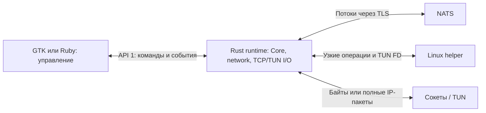
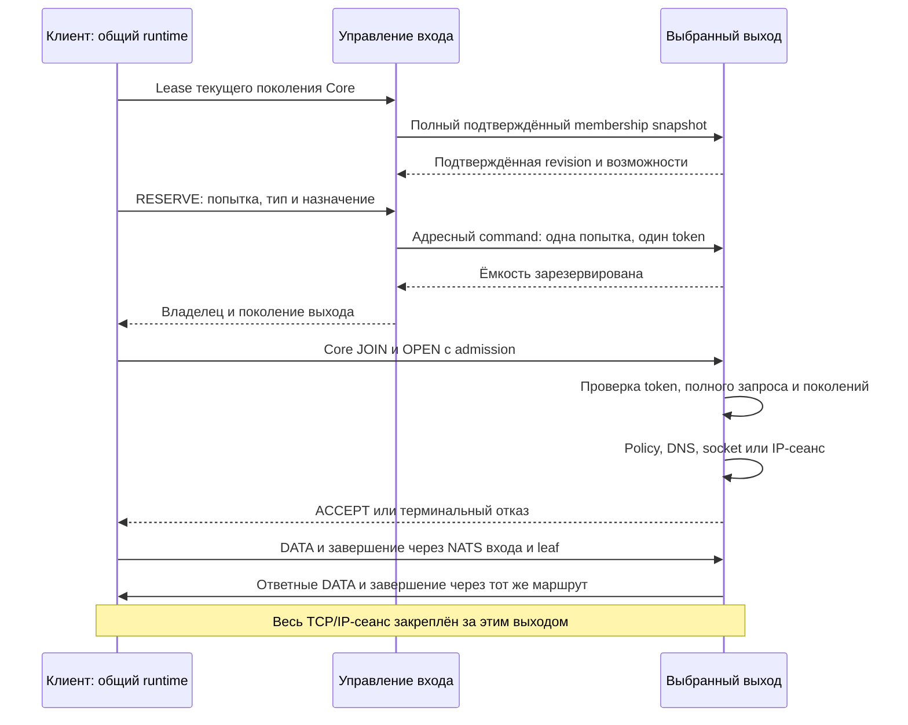

# Общий сетевой runtime

`skvoz-network` 0.5.0 связывает TCP-сокеты и полные IPv4/IPv6-пакеты с одной
реализацией [Core 4.1.0 / NatsRuntime](nats-runtime.md). Формат метаданных —
network 5, назначение выхода — route 1, локальный API — 1. Это текущий контракт исходников; установка,
маршрутизация, изоляция в реальном окружении и производительность требуют
отдельной процессной и сетевой квалификации.

## Границы и поставка

Библиотека, `skvoz-network-runtime` и [FFI ABI 1](../network/ffi/README.md)
используют один actor и `NetworkEngine`. Ruby управляет серверными процессами,
пользователями и сертификатами; GTK управляет клиентским соединением и окном.
Прикладные байты и IP-пакеты проходят через Rust I/O, без сериализации в
управляющий JSON. Payload actor владеет одним Core, PeerId и сетевым I/O.
Ограниченные управляющие задачи обслуживают leases и назначения независимо от
payload I/O; каждой функции управления соответствует своё NATS-соединение.
Нода только с функцией управления не создаёт payload Core, TUN или helper.
[Самостоятельный демон Core / IPC 1](daemon-ipc.md) сохраняет отдельное назначение.

Общие Linux/Android FD/TUN и Linux process/create/`SCM_RIGHTS` вынесены в [native boundary](../network/native/README.md).
Основная библиотека и Core запрещают `unsafe`. Узкий
[helper](../network/helper/README.md) создаёт TUN и собственные маршруты,
правила firewall и настройки DNS. Он не принимает shell, скрипты, произвольные
команды или пути для удаления.



## Конфигурация и запуск

Сборка из корня:

```sh
cargo build --release --locked -p skvoz-network -p skvoz-network-helper --features skvoz-network/linux-runtime
target/release/skvoz-network-runtime --version
target/release/skvoz-network-helper --version
```

CLI runtime: `--config <private-json-file> --control-fd <fd>`; для выходного IP-сервера
обязателен также `--helper-fd <fd>`. Родитель создаёт соединённую Unix socketpair,
передаёт только назначенные FD и закрывает свои копии после передачи владения.
`--help` и `--version` не подключаются к сети. Конфигурация содержит секреты,
ограничена 32 КиБ и читается из закрытого файла; launcher удаляет её после HELLO.

Корневой объект содержит ровно `v`, `role`, `core`, `network`, `server`, `routing`.
`v=2`, роль `client` или `server`; у клиента `server=null`.
Все поля обязательны; неизвестные и повторные ключи отклоняются.
`core` задаёт `url`, `tls_server_name`, `trust`, `ca_file`, `username`, `password`,
`namespace`, `peer_id`, `membership`, `allowed_peers`, `initiate`.
Числовые PeerId записываются каноническими десятичными строками.
Клиент использует назначенный устройству PeerId из диапазона `1..2^63-1`.
Выход использует уникальный PeerId больше `2^63`, кратный 8. PeerId `"0"`
принадлежит функции управления назначением. Все эти участники используют
`allowlist` с первоначально пустыми `allowed_peers` и `initiate`;
подтверждённое назначение и membership snapshot добавляют точные разрешённые
поколения во время работы.
`routing` содержит `egress` и nullable `authority`. У клиента это
`{egress:false,authority:null}`. У выходного сервера `egress=true` и обязательна
конфигурация `server`. Управляющая функция задаёт `authority={core,registry}`;
её `core.peer_id="0"`, а реестр содержит `revision`, `devices`, `nodes`.
Standalone совмещает обе функции. Вход без выхода задаёт `egress=false`,
`server=null`, пустые семейства и обязательную `authority`.
Участники должны иметь совместимые версии Core/network и текущую схему
профиля подключения. Неподдерживаемые версии отклоняются явно; преобразования
старых конфигураций и протоколов не выполняются.
Проверка доверия описана в [общем профиле транспорта](nats-runtime.md#профиль-транспорта).

`network` содержит `families`, `max_mtu`, `channels`, `limits`:
IPv4/IPv6 задаются `[4]`, `[6]`, `[4,6]`, MTU — 576–1500
(с IPv6 не менее 1280), каналов данных — 1–8. Только сервер без IP backend
может задать пустые семейства. Это возможности runtime; политика выбора
семейств конкретной IP-сессии задаётся отдельно в START_IP.
Полный ресурсный профиль создаёт host; библиотечные типы и валидатор находятся
в `network/src/config.rs`. Настройки прежнего демона этим runtime не читаются.
Параметры gateway описаны в [руководстве сервера](server-connector.md#конфигурация-и-мосты-к-внутренним-сервисам).

## API 1 и дескрипторы

Сообщение — длина JSON в `u32be`, затем UTF-8 JSON до 32 768 байт:

```json
{"v":1,"id":1,"op":"HELLO","args":{"api":1,"network":5},"fd_count":0}
```

Ответ содержит ровно `{v,id,result,error,fd_count}`, событие —
`{v,seq,event,data,fd_count}`. При успехе `error=null`, при ошибке `result=null`.
ID команд возрастают от 1 до 2 147 483 647; seq событий — до
9 223 372 036 854 775 807. Одновременно допускается одна команда.
HELLO должен прийти за 5 секунд и отвечает независимо от готовности NATS.
У клиента lifecycle `ready` означает готовность Core и подтверждённого lease
у управления. JOIN с конкретным выходом выполняется после назначения сеанса.
Выход сообщает `ready` после готовности Core, lease и своего IP backend,
если он настроен; вход без выхода — после готовности управляющего транспорта.
Потеря lease или смена собственного поколения Core запускают ограниченное
завершение runtime. Первоначальное ожидание готовности ограничено 30 секундами.
Начатый фрейм имеет срок 5 секунд, остановившаяся запись — 3 секунды.
Повреждённая оболочка, повторные ключи, неполный EOF или неверные rights
закрывают owner и принадлежащие ему ресурсы.

`SCM_RIGHTS` относится к первому байту фрейма, число FD строго равно
`fd_count`. Принятый FD закрывается при отказе. Отправитель удерживает оригинал
до успешного ответа и затем закрывает его. Номер FD другого процесса не
заменяет передачу дескриптора. TUN должен быть неблокирующим, без PI/VNET/GSO.

| Команда | Аргументы | Результат |
| --- | --- | --- |
| HELLO | `{api:1,network:5}` | Роль и capabilities. |
| STATUS | `{}` | `{lifecycle,mode,session,counters,routing}`. `routing` содержит `control_ready:boolean` и `eligible_exits:0..8`. |
| START_PROXY | `{http_bind,socks_bind}`; nullable numeric endpoints | `{http,socks}`; оба listener открываются атомарно. |
| STOP_PROXY | `{}` | `{}` после остановки связанных потоков. |
| OPEN_TCP | `{host,port}` | `{handle}` и один FD после удалённого ACCEPT. |
| START_IP | `{families,family_policy,max_mtu,channels}` | `{handle}` новой согласуемой сессии. |
| ATTACH_IP | `{handle,interface,mtu}` и один TUN FD | `{handle}` после проверки FD. |
| LOCAL_READY | `{handle}` | `{handle}`; ACTIVE приходит отдельно. |
| STOP_IP | `{handle,reason}` | `{handle}` после ограниченной очистки; reason `user_stop`, `mode_change`, `shutdown`. |
| PREPARE_SHUTDOWN | `{}` | `{}` после остановки owned work; снятие клиентского guard отдельно подтверждает helper. |
| UPDATE_REGISTRY | `{revision,devices,nodes}` | `{}` после применения реестра; только runtime с функцией управления. |

Клиент начинает в `idle`, выбирает `proxy` или `ip`; смена выполняется через
stop → cleanup → start. OPEN_TCP доступен только в `proxy`.
В START_IP и метаданных `ip-session` поле `families` — непустой набор
предлагаемых клиентом семейств, `family_policy` обязательно:
`auto` выбирает пересечение с настроенными серверными backend,
`require_all` требует все предложенные семейства. Пустое пересечение или
недоступное обязательное семейство отклоняется с `unsupported_family`
до настройки клиентского TUN. CONFIG содержит фактически выбранные семейства,
только их source grants, маршруты, DNS и egress. Клиент проверяет непустой
поднабор предложения в `auto` и точное совпадение в `require_all` до CONFIGURED.
Семейства IP внутри туннеля независимы от адреса подключения к NATS.
Ошибки версии, TLS, identity, ACL или объявленного backend не запускают
повторное подключение с меньшим набором семейств.
Выход обслуживает входящие TCP/IP автоматически и отвергает клиентские команды
START/STOP/ATTACH/LOCAL_READY/OPEN_TCP. HELLO/STATUS/PREPARE_SHUTDOWN доступны обеим ролям;
UPDATE_REGISTRY доступен только серверной функции управления.
В STATUS `control_ready` показывает готовность route-соединения управляющей
функции либо актуального lease участника. `eligible_exits` — число выходов с
подтверждённым полным текущим membership у управляющей функции; у остальных
участников оно равно нулю. Выбор для конкретного запроса дополнительно проверяет
подтверждение запрашивающего устройства, семейства и занятую ёмкость.
Listener принимает только явно заданный loopback/private numeric адрес;
публичный bind отклоняется. Два `null` включают управление TCP только через API.

События: CONFIGURED, ACTIVE, CLOSED, RUNTIME_STATE, STATS и клиентский REQUEST.
Seq возрастает строго; пропуски допустимы при замене ожидающего STATS
или промежуточного REQUEST того же id. Записи `opening`/`active` заменяются
последним состоянием до передачи owner; terminal и уже объявленные FFI записи
сохраняются. CLI передаёт ограниченные пакеты сообщений без задержки на каждую запись.
STATS содержит один `counters`, выдаётся не чаще раза в секунду и заменяет
ожидающий старый снимок. REQUEST содержит только
`{id,protocol,host,port,result,uploaded,downloaded}`: идентификатор локален runtime,
protocol — HTTP/CONNECT/SOCKS5/TCP, без path/query, заголовков и содержимого.
Весь выход ограничен 128 сообщениями / 128 КиБ; terminal events не отбрасываются,
переполнение закрывает owner. Ошибки API: `unsupported_version`, `unsupported_family`, `invalid_request`,
`invalid_state`, `unknown_handle`, `forbidden`, `overloaded`, `local_setup_failed`,
`network_unavailable`, `timeout`, `closed`.

FFI получает тот же JSON без Unix-фрейма. Borrowed входной FD дублируется
с CLOEXEC; выходной FD принадлежит caller. Недостаточный буфер оставляет точное
сообщение и его FD в очереди; destroy закрывает недоставленные FD. Handle имеет
поколение; старый handle отклоняется. Полный C-контракт —
[`skvoz_network.h`](../network/ffi/include/skvoz_network.h).

STOP_IP для завершённой собственной сессии идемпотентен в истории последних
128 завершений текущего процесса. Более старый handle становится неизвестным;
активные handles сохраняются. Helper хранит такую же конечную историю
RETIRE_PEER. Восстановление сохранённого клиентского guard использует durable
RECOVER и не зависит от этой истории.

## Назначение выхода и владение сеансом

Управляющая нода содержит ограниченный реестр устройств и выходов. Это управление доступом и назначением, а не транспортный владелец TCP-сокетов или NAT. Общий Rust runtime выполняет назначение; Ruby host хранит клиентские учётки, служебный доступ нод и TLS.

Новый proxy-поток или VPN-сеанс запрашивает назначение с `(authority_epoch, device_id, client_core_epoch, sequence)`. Sequence монотонно растёт для текущего поколения клиента. Runtime выбирает готовый совместимый выход с наименьшей занятой ёмкостью; равные кандидаты чередуются. На этом этапе проверяются доступные семейства и ёмкость. DNS, адресная policy и подключение назначения выполняются выходом после назначения, до передачи DATA.

Попытка получает одного владельца. Резерв содержит исходный запрос, поколение владельца и одноразовый 128-битный token. OPEN проверяет эти данные до выделения native ресурсов. Повтор запроса не меняет владельца, назначения или срок резерва; поздний ответ не открывает сеанс у другого выхода. CANCEL направляется исходному владельцу. История результатов ограничена отдельно от sequence high-water: вытеснение записи истории не разрешает повтор старой попытки.

Явный отказ из-за временно недоступной ёмкости до выбора владельца допускает
новую попытку в пределах исходного срока установки. Это позволяет дождаться
подтверждения membership нового устройства. Потерянный ответ, отказ выбранного
выхода и уже переданные прикладные данные такого повтора не допускают.



Все Core DATA и control frames проходят через NATS. Отдельный ограниченный канал маршрутизации обслуживает leases и назначения, пока payload actor занимается сокетами и Core. Для DATA не создаётся дополнительного этапа копирования через Ruby или управляющую ноду.

Управление route1 использует тот же application account и namespace:

| Subject | Публикует → получает |
| --- | --- |
| `<namespace>.route.client.<device>` | Устройство → управление. |
| `<namespace>.route.node.<node>` | Выход → управление. |
| `<namespace>.route.reply.client.<device>` | Управление → устройство. |
| `<namespace>.route.reply.node.<node>` | Управление → выход. |
| `<namespace>.route.command.<node>` | Управление → конкретный выход. |

JSON-envelope содержит ровно `{v,from,epoch,request,body}`: `v=1`,
`from` — numeric identity отправителя, `epoch` — его ненулевое 128-битное
поколение в 32 lowercase hex символах, `request` — ненулевой sequence.
Поле `body.op` задаёт тип сообщения. Получатель проверяет sender identity
одновременно по subject, NATS permissions и envelope; token не заменяет
аутентификацию. Строгие типы сообщений находятся в
[`routing.rs`](../network/src/routing.rs), переходы — в
[`routing/state.rs`](../network/src/routing/state.rs).

В OPEN передаётся компактное admission, а исходный полный запрос хранится
в резерве выбранного выхода. Например, оболочка TCP содержит
`{v:5,type:"assigned",admission:{authority,sequence,token},target:{v:5,type:"tcp",host,port}}`.
Выход сверяет target, устройство и поколение из проверенного Core JOIN,
authority/owner epoch, срок резерва и одноразовый token. Повторный OPEN того же
разрешения не создаёт второй native ресурс.

### Поколения, сроки и восстановление

Для устройства и выходной ноды допускается одно актуальное поколение. Renewal запрашивается каждые 2 с. Участник прекращает использование lease через 6 с, отсчитанных от собственного monotonic времени отправки подтверждённого renewal request. Ответ должен соответствовать запросу и актуальным поколениям; задержанное прибытие ответа не переносит срок отсчёта. Управление допускает замену поколения через 9 с после последнего принятого renewal, включая 3 с на очистку прежнего владельца. Выход ограничивает Core membership конкретным подтверждённым поколением каждого устройства. Неполный или устаревший snapshot не даёт права принимать JOIN/OPEN.

Потеря Core транспорта, смена authority/owner epoch или истечение lease закрывают старые сеансы и освобождают принадлежащие им native ресурсы. При смене собственного поколения Core или потере lease runtime завершает работу после ограниченной очистки; серверный supervisor перезапускает весь контейнер. Новый runtime получает фактическое поколение Core и новое admission после действующего epoch fence. Клиентский host получает терминальное состояние и использует свой обычный lifecycle подключения. Повторно создаваемый сеанс может выбрать другой готовый выход. Прозрачного переноса живого TCP, IP grants и NAT нет; единственный вход остаётся единственной точкой отказа.

Вся установка нового сеанса имеет один срок 15 с. Ответ на резервирование ограничен 2 с, финальный DNS/connect — 3 с; они входят в общий срок. Резерв действует 15 с от его принятия и не продлевается повторами. Очистка отменённого резерва занимает до 3 с, поэтому предел оставшегося без клиента резерва — 18 с от принятия. Shutdown имеет общий срок 8 с, включая очистку; Compose предоставляет 15 с.

### Конечные управляющие бюджеты

Пул содержит до 8 выходов и 128 устройств. Общие пределы admission — 2048 TCP и 128 VPN; одновременно pending — до 256 запросов, до 32 на устройство. Локальные существующие payload budgets остаются отдельными. Эти пределы действуют вместе с byte/record budgets и не обещают одновременно заполнить все таблицы. Неактивному клиенту не закрепляется неиспользуемая полоса; QoS, rate limits и равная полоса по умолчанию не вводятся.

Управляющее сообщение ограничено 4096 байт до выделения очереди parser. Очереди ограничены 64 входящими и 16 исходящими записями. Дополнительный backing: управление 8 МиБ/4096 records, выход 4 МиБ/2048 records, клиент 1 МиБ/512 records. В них учитываются parser, каналы, membership, reservations и история; STOP, CANCEL и renewal имеют зарезервированную возможность прогресса.

Membership передаётся максимум тремя частями по 48 строк; runtime применяет только полный актуальный snapshot атомарно. Он содержит разрешённые устройства и поколения, не список всех активных потоков. Управление учитывает reported reserved+active и неподтверждённые dispatches после processed watermark; потерянный отчёт не освобождает ещё занятый резерв. Новая command sequence может пройти потерянный промежуток, после чего опоздавшая более ранняя команда окончательно устарела.

Для VPN на устройство действует отдельный guard. Подтверждение отсутствия должно относиться к точной попытке, владельцу и поколениям, а processed watermark — достигнуть исходного RESERVE. Ответ, полученный до доставки исходного RESERVE, не освобождает guard. Терминальный ответ возможен только после очистки native/TUN/NAT ресурсов либо после подтверждённого epoch fence.

## Данные, кредит и границы

Назначение TCP содержит метаданные `{"v":5,"type":"tcp","host":"example.org","port":443}`.
При открытии потока они оборачиваются в `assigned` с `admission={authority,sequence,token}`.
Такая же оболочка обязательна для первого `ip-session`; последующие `ip-data`
связаны с уже подтверждённой IP-сессией. Выход проверяет admission до native setup.
Сервер проверяет DNS и policy, подключает проверенный numeric адрес, затем
принимает поток. Обычный TCP-сервис на loopback доступен только по явному
разрешению CIDR и порта; management-порты защищены на всех loopback-адресах.
Для IP-пакетов запрет loopback действует независимо от allow.
Частичная отправка сохраняет суффикс; CONSUME возвращает кредит
после полной фактической записи DATA chunk в локальный сокет, включая короткий
последний chunk. Частичная запись сохраняет резерв всей allocation. EOF закрывает направление
после очереди, оставляя возможным ответ другой стороны.
Ошибочное HTTP-обрамление отклоняется с `400 Bad Request` до открытия потока;
отказ удалённого назначения возвращает `502 Bad Gateway` или SOCKS5 failure.
Ответ об отказе дописывается в локальный сокет после закрытия потока Core.
События STATS сообщают накопленные счётчики раз в секунду; мгновенный STATUS
читает текущие счётчики, а desktop host отображает последний полученный STATS.

IP-сессия содержит управляющий поток и 1–8 потоков данных того же Core.
CONFIG, все связанные каналы, взаимное READY и подтверждённый helper setup
предшествуют ACTIVE. Пакеты привязаны к проверенному PeerId и поколению Core;
source grants проверяются до TUN. Запись имеет заголовок 8 байт и один полный
IP-пакет не длиннее MTU; неизвестные виды, flags, длины и повреждённые пакеты
отклоняются. Частичная запись пакета в TUN аварийна.
Осознанное отбрасывание полного пакета освобождает кредит, копирование — нет.
Объём IP-данных в полёте управляется адаптивным byte/record кредитом Core.
Размер локального пакета работы не ограничивает число DATA-кадров, ожидающих
подтверждения потребления: активная сессия использует доступный общий кредит.
Ethernet/L2, multicast и IP jumbograms этим контрактом не доставляются.
Byte и record limits действуют одновременно: поток небольших IP DATA может
исчерпать records раньше байтового окна. Например, клиентский pool допускает
2112 records; по одному пакету 1400 байт это около 2,8 MiB непотреблённого
payload. TCP throughput не доказывает максимальную скорость TUN/IP; этот путь
требует отдельного matched direct и смешанного packet/TCP измерения.
При одном data stream его собственный sender headroom уменьшает occupancy
до 1848 records, то есть около 2,5 MiB для пакетов по 1400 байт.

| Ограничение начального профиля | Клиент | Сервер |
| --- | --- | --- |
| Потоки Core / IP-сессии | 512 / 1 | 2048 / 128 |
| Потоки одного peer | 512 | 512 |
| Максимальное окно / initial / max frame | 32 МиБ / 64 КиБ / 16 КиБ | 32 МиБ / 64 КиБ / 16 КиБ |
| Receive credit budget / peer | 32 МиБ / 32 МиБ | 128 МиБ / 32 МиБ |
| SEND budget / peer | 2 МиБ / 2 МиБ | 64 МиБ / 2 МиБ |
| Runtime bytes / records | 96 МиБ / 16 384 | 512 МиБ / 131 072 |
| NATS subscription / join / client frames | 64 / 32 / 16 | 64 / 32 / 16 |
| Packet queue на направление сессии | 256 КиБ / 256 | 256 КиБ / 256 |
| Управляющая очередь сессии | 32 КиБ / 8 | 32 КиБ / 8 |

TCP-соединение занимает один Core stream. IP control и data channels
занимают тот же общий пул; одна управляющая и одна data-цепочка занимают два
слота. В Ubuntu режимы взаимоисключающие. Значения — пределы admission,
а не обещание одновременно заполнить каждый байтовый и record budget.

Пустое TCP-соединение держит только ограниченное состояние сокета и учётную запись.
Буфер SEND выделяется при чтении и освобождается после опустошения; остаток
частичной отправки сохраняется. Полученный буфер передаётся получателю без
копирования. Runtime резервирует aggregate receive credit одного Core pool, SEND и конечные
record/metadata/transport budgets; count admission не умножает максимальное
окно на число TCP slots. Окна автоматически используют свободный обеспеченный
pool без пользовательских настроек скорости. Уже объявленный кредит нельзя
переиспользовать до actual consumption или ordered peer barrier.
Рост окна зависит от actual consumption самого потока. Один поток оставляет
1/8 конечного byte/record flight для остальных; в полном peer-профиле это
4 МиБ/264 records, максимум occupancy одного sender — 28 МиБ/1848 records.
Это headroom памяти и метаданных, а не ограничение скорости. Если несколько
непрочитанных потоков вместе исчерпали pool, применяется ограниченная отмена
stalled потока при запросе другого живого потока; точные условия и сохранение
уже обещанного кредита описаны в [wire](wire.md#кредит-и-перераспределение).
Native payload отменённого потока остаётся charged до реального cleanup.

Существующая backend очередь ограничена 512 событиями; дополнительно
резервируется `512 × max_frame` (8 MiB в каноническом профиле). Это покрывает
Box уже извлечённого события даже после того, как отмена Core вернула кредит,
до удаления события из очереди. Новая очередь и предварительное выделение
payload не создаются.

IP parser остаётся ограничен 64 КиБ. Перед извлечением каждого DATA Core
проверяет оставшееся место parser с учётом всех ранее разрешённых chunks того
же batch. Непоместившийся chunk остаётся в Core до bounded record drain;
остальные готовые потоки и terminal events продолжают обслуживаться. Кредит
возвращается после фактической обработки соответствующих records.
Если очередь полученных IP-пакетов заполнена, следующий record остаётся
в parser до освобождения места после полной записи пакета получателем.
При заполнении отправляющих очередей всех активных IP-сессий runtime
приостанавливает чтение TUN. На общем серверном TUN наличие места хотя бы у
одного peer сохраняет чтение; пакеты перегруженного peer могут отбрасываться,
чтобы он не останавливал остальных. Неверные и запрещённые пакеты отклоняются,
а явная попытка enqueue сверх конечной очереди получает `Overloaded`.

Native host отдельно учитывает payload в общем runtime Budget: каждый переданный
Box целиком резервируется до полной записи/drop, в том числе после отмены Core.
Ёмкость массива WritePending учитывается до освобождения. Временная нехватка
общего native budget сохраняет исходный DATA в начале существующей backend
очереди: повтор не копирует payload и не меняет порядок. Отмена другого потока
может освободить его удержанные chunks; FIN/RemoteFinished не обгоняют DATA. Это независимые
Core promise, учёт native allocations и отдельный backend shadow, без
сохранённых массивов прошлых больших окон.
Минимальный runtime budget гарантирует место для одного дополнительного receive
budget native payload; жёсткий предел всех native allocations — общий runtime
Budget, и отменённые буферы могут занимать его свободное место сверх этого
гарантированного минимума. Расчёт также включает metadata, транспорт, максимальную
команду API и полную очередь ответов; необеспеченный профиль отклоняется до I/O.

TCP использует Linux autotuning буферов ядра, без принудительного SO_RCVBUF или
SO_SNDBUF. Unix/API сокеты сохраняют конечные настроенные очереди. Kernel socket
memory не входит в userspace ledger: при проверке контейнера нужно учитывать
`memory.current`, `memory.stat sock` и `memory.events oom/oom_kill`. Число slots
не гарантирует, что все активные autotuned TCP-сокеты помещаются в runtime budget.

Локальная очередь допускает 128 незавершённых HTTP/SOCKS handshakes;
всего до 160 записей, включая полные отказы. Ожидание setup ограничено
10 секундами; полная запись локального отказа — 1 секундой. Перегрузка HTTP
получает `503`, SOCKS5 — полный отрицательный ответ. Истинное исчерпание
FD или памяти состояния может закрыть новую попытку. Здоровые простаивающие
соединения не вытесняются. На сервере ожидают до 256 назначений, 64 на peer;
одновременно выполняются до 16 подключений, 4 на peer, с вращением peers
и FIFO внутри peer. DNS имеет отдельные 16 разрешений на выполнение;
отменённое ожидание не освобождает разрешение реального системного resolver
до его завершения. Общий deadline 10 секунд включает ожидание в очереди.
Причины отказов видны в конечном REQUEST и агрегированных журналах runtime:
`buffer`, `core_slots_or_credit`, `setup_queue`, `setup_timeout`, `destination_queue`.
При массовом завершении TCP конечные записи выдаются по доступному месту в
очереди API. Ожидающее завершения состояние входит в общий предел соединений;
его нельзя обойти новыми открытиями после освобождения слота Core. Владелец,
который перестал читать, закрывается при переполнении обязательной очереди
или после 3 секунд блокировки завершения. Читающий владелец получает конечные
записи и обязательный ответ на STOP_PROXY/PREPARE_SHUTDOWN.
За полный turn Core допускается до 16 записей / 128 КиБ на peer суммарно.
Этот пакет работы уменьшает расходы на проходы Core и подтверждения при активной
передаче; лимиты памяти и очередей задаются отдельно. TCP и IP расходуют один
байтовый бюджет, а запас IP при совместной работе сохраняется.
Byte/DATA квант сбрасывается после каждого полного Core turn, без фиксированного
интервала скорости. FIN и CANCEL совместно занимают не более 4 записей;
только этот terminal запас возобновляется после полного turn и не ранее чем
через 5 мс, без накопления разрешений. Это ограничение локальной отправки, не remote ack
и не защита от произвольной задержки планировщика. Прямые отмены
setup удерживают Core slot в конечном наборе до фактического CANCEL.
При окончательном завершении поколения runtime сначала закрывает его Core
transport. Освобождение локальных native-сокетов после этого не ждёт отправки
terminal envelopes через завершённый транспорт. Надёжные события API,
незавершённые ответы и очистка helper сохраняют свои ограничения и контроль
ошибок. Обычная обработка FIN действующего соединения использует описанный
terminal запас.
Клиент обрабатывает до 32 входящих управляющих и 32 входящих data envelopes,
сервер — до 256 каждого вида; выходной квант обоих равен 32.
Native I/O обходит до 64 соединений между полными turns Core; после полного
обхода меняет начало для справедливого обслуживания. Ожидание без работы
выполняется после полного обхода, без постоянного активного пробуждения.
Данные учитываются одновременно по байтам и числу записей. Эти логические
границы не равны RSS: kernel buffers, DNS, библиотеки и allocator требуют
измерений. Счётчики `uploaded` считают локальные байты, принятые Core;
`downloaded` — реально записанные сокету байты. Служебное framing и намеренно
отброшенные данные не считаются полученными байтами.

Native driver выполняет ограниченные неблокирующие попытки I/O. При наличии
native работы пауза между попытками ограничена 5 мс; без неё runtime ждёт Core,
команду, изменение control view или ближайший срок, с верхним пределом 1 с.
Исторический профиль network 3 с фиксированным окном 64 KiB проверялся в
изолированных Linux amd64 контейнерах:
два прогона по 30 минут с 256 простаивающими и 32 активными соединениями;
16 клиентов по 64 соединения — 10 минут; сервер Ruby/NATS/runtime с 1024
простаивающими, 32 активными и одним медленным соединением — 30 минут,
затем 10 000 циклов открытия и закрытия. Пик памяти всего серверного контейнера
с пределом 2 CPU / 1 ГиБ составил около 165 МиБ; пиковый RSS runtime сервера —
9,3 МиБ, максимальный RSS runtime клиента — 7 МиБ. После очистки не осталось
активных TCP-потоков; дескрипторы вернулись к базовому уровню с сохранением
до одного ленивого транспортного канала. Сравнение полезной скорости на одном
и 16 потоках, в обоих направлениях, по пять 30-секундных замеров сохранило
скорость в допуске 10%.

Эти результаты относятся к указанной прежней матрице и не доказывают ресурсы
или скорость текущего network 5 с адаптивными окнами и назначением выхода. Полная одновременная нагрузка
всех бюджетов, WAN и производительность IP-передачи требуют отдельной проверки;
лимиты очередей не задают универсальную ёмкость или SLA.

## Helper и восстановление

Helper имеет отдельный API 1 без credentials Core. На сервере root bootstrap
оставляет helper только NET_ADMIN и передаёт единственный его control FD runtime.
Ruby/NATS/runtime работают с UID 10001 без capabilities. Полная смерть
runtime/helper завершает контейнер; новый bootstrap выполняет Compose.
На Ubuntu root service проверяет connecting UID и разрешение polkit;
runtime и GTK остаются обычными процессами пользователя.

Lease registry 1 сохраняет назначения за peer и tombstones, без автоматической
передачи адреса другому peer. Journal хранит только собственные объекты;
неожиданное чужое состояние или повреждение блокирует recovery.
На клиенте авария вызывает ABORT с сохранением drop guard. Явная остановка
после очистки вызывает RESTORE. Новый owner сначала RECOVER, затем использует
сохранённый broker IP и исходную TLS identity: скрытого DNS fallback нет.
Недостающий подтверждённый snapshot требует явного восстановления сети.
Потерянные TCP/IP потоки не продолжаются побайтно после переподключения.

Детерминированные проверки библиотек и ABI:

```sh
cargo test --locked -p skvoz-network --features linux-runtime
cargo test --locked -p skvoz-network-native -p skvoz-network-helper -p skvoz-network-ffi
```

Реальный TUN/NATS стенд — `python3 testbench/run.py network`; он создаёт
одноразовые контейнеры с дополнительными полномочиями и требует отдельного
запуска. Совместный стенд продуктовых runtime/helper —
`python3 testbench/run.py network-runtime`: NAT44, routed IPv6, DNS, guard и
аварийное восстановление через API 1. Его условия и границы описаны в
[руководстве стенда](../testbench/README.md).
Успех кодеков, compiler или ABI сам по себе не подтверждает сетевую
изоляцию, поддержку платформы и пропускную способность.

## Диагностика при библиотечном встраивании

`RuntimeHandle::diagnostics(enabled) -> Result<RuntimeDiagnostics, RuntimeFailure>`
управляет дополнительным сбором и читает последний числовой образец. Это Rust
embedding API, не новая команда локального API1/FFI ABI1 или network wire.
По умолчанию сбор выключен. ON/OFF изменяет epoch `collection`; переход OFF→ON
начинает новые накопленные значения. До публикации `sample_age_ms=null`, при OFF
числовые значения сброшены. Закрытый runtime возвращает `Closed`.

Один actor владеет одним Core runtime; его внутренний recovery сохраняет текущие
счётчики, но Core timing учитывает только Ready turns. Новый RuntimeHandle
начинает отдельный collection, даже если его номер совпадает с предыдущим;
host должен убрать старый образец при замене handle. Образцы публикуются не чаще
раза в секунду. `elapsed_ms` — возраст сбора; `sample_age_ms` — возраст последнего
образца. Host явно отличает pending, disabled и устаревшие значения.

Фиксированное хранение диагностических значений резервирует1024 байта из прежнего
runtime budget. Actor использует локальные счётчики, одно чтение atomic control
за turn и один mailbox lock при публикации; синхронизации на каждый пакет нет.
При OFF дополнительные timestamps пропускаются. `native_us` измеряет TUN turn,
`drive_us` — вызов сетевого drive, `core_*_us` — вложенные времена Core в
микросекундах с ожиданиями. Эти интервалы перекрываются и не показывают загрузку
CPU. `read_full`/`write_full` считают полные серии из16 TUN операций,
`read_block`/`write_block` — WouldBlock, `read_paused` — паузы при backpressure.
Сбой чтения диагностики host обрабатывает отдельно от управления соединением.
