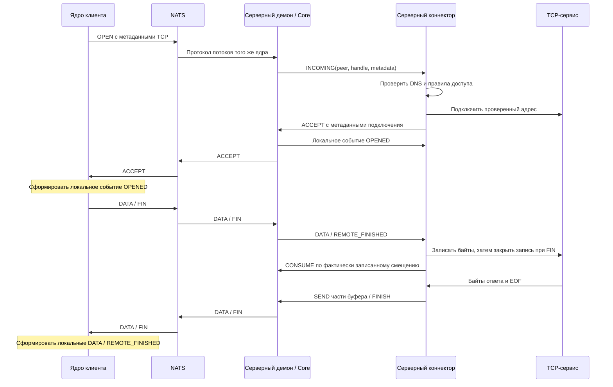

# Серверный коннектор

`skvoz-server` передаёт байты TCP-соединений через NATS, используя то же
универсальное ядро Core, что и клиенты. Текущая реализация на Ruby 4.0.7 управляет
NATS 2.15.0 и `skvoz-core-daemon` 1.4.0 (Core 3.0.0, IPC 1). Другая реализация
коннектора может использовать те же контракты метаданных назначения и IPC.
HTTP-запросы, потоковые ответы и другие протоколы поверх TCP передаются без изменений.

## Развёртывание через Compose

Нужны Linux x86_64, Docker и Docker Compose 2.24.4+, а также доступный извне
публичный IP-адрес или доменное имя. Требуемое поведение переопределений описано
в [правилах объединения Compose](https://docs.docker.com/reference/compose-file/merge/).
Внешний TCP-порт 80 должен вести к обработчику проверки HTTP01, а выбранный порт
брокера — к NATS на этом сервере. Центр сертификации ACME должен поддерживать
профиль `shortlived` и IP-идентификаторы при установке по IP-адресу. По умолчанию
используется рабочий каталог Let's Encrypt. Его
[профиль короткоживущих сертификатов](https://letsencrypt.org/docs/profiles/#shortlived)
поддерживает IP-адреса и доменные имена. Перед выпуском примите условия центра сертификации.

Из корня репозитория задайте настройки развёртывания, не содержащие секретов:

```sh
export SKVOZ_IMAGE='ghcr.io/OWNER/REPOSITORY/skvoz-server:REVIEWED_TAG'
export SKVOZ_ADDRESS='YOUR_PUBLIC_IP_OR_DNS_NAME'
export SKVOZ_ACME_EMAIL='YOUR_CERTIFICATE_CONTACT_EMAIL'
export SKVOZ_ACME_TERMS_AGREED=true
docker compose -f connectors/server/compose.yaml up -d
docker compose -f connectors/server/compose.yaml exec -T server skvoz-server health
```

Вместо шаблона образа укажите опубликованный образ со страницы GitHub Packages
этого репозитория или его неизменяемый digest. После успешных проверок процесс CI
публикует образ в `ghcr.io/<owner>/<repository>/skvoz-server`; наличие файла CI
само по себе не означает, что образ уже опубликован. Настройки видимости и доступа
пакета должны разрешать серверу загрузку. Digest фиксирует точное содержимое образа.

В образ входят Ruby, библиотеки с зафиксированными версиями, демон ядра и брокер.
Создавать пароль пользователя и серверный сертификат вручную не требуется.
Постоянный том `state` хранит пользователей, последовательно выделяемые
идентификаторы, TLS-материалы и учётную запись ACME. Закрытый сокет
администрирования находится внутри этого тома. Контейнер работает с UID 10001,
процессом init, корневой файловой системой только для чтения, ограниченным
временным хранилищем и без дополнительных полномочий Linux capabilities.
Сохраняйте том при обновлениях; его копия также содержит учётные данные и закрытые ключи.

`SKVOZ_LISTEN_PORT` по умолчанию равен 4222 и задаёт внешний порт брокера.
Экспортируемые профили клиентов содержат этот порт; внутри контейнера брокер
продолжает слушать 4222. Внешний порт 80 направляется на внутренний 8080.
`SKVOZ_ALLOW_CIDRS` — необязательный список разрешённых внутренних сетей через
запятую; по умолчанию доступ разрешён только к публичным адресам Интернета.

Сборка в CI и локальная сборка используют один
[Dockerfile](../connectors/server/Dockerfile). В нём демон ядра компилируется
командой Cargo на промежуточном этапе Rust, gems устанавливаются в Ruby Bookworm,
а готовые бинарники и библиотеки копируются в итоговый образ Ruby Bookworm.
Этап `base` содержит gems и Ruby-код; `tests` добавляет RSpec, тестовые данные
и бинарники Core, NATS и локального центра ACME Pebble;
`deploy` — итоговый образ сервера. CI запускает проверки этапа `tests` и собирает
`deploy` для GHCR; локальная сборка через Compose также выбирает `deploy`.
В GitHub Actions проверки и публикация выполняются в одном job с общим
Buildx builder: этапы `tests` и `deploy` переиспользуют сборку ядра и библиотеки Ruby для запуска.
После проверки `deploy` через Compose публикация использует кеш этого же builder,
без повторной компиляции ядра и установки gems. В pull request выполняются
проверки без публикации.
Ruby уже входит в базовый образ. На машине сборки нужны Docker/Compose;
устанавливать Ruby, Rust или Python для сборки сервера не требуется.
Такое разделение этапов сохраняет компиляторы внутри сборки.

Тот же образ можно собрать локально из публичных исходников:

```sh
SKVOZ_IMAGE=skvoz-server:source docker compose \
  -f connectors/server/compose.yaml -f connectors/server/compose.source.yaml up -d --build
```

Используйте те же настройки адреса, почты и согласия с условиями. При сборке
зафиксированы digest образов сборщика, среды выполнения и брокера, а также
версии зависимостей в Cargo/Gem lock-файлах. Проверенная платформа образа —
`linux/amd64`; другие архитектуры требуют отдельной проверки.

## Автообновление готового образа

В комплекте есть небольшие [скрипты развёртывания](../connectors/server/deployment/):
`auto-update-enable.sh` устанавливает systemd service/timer на серверной машине,
`auto-update-disable.sh` выключает их. Для этого нужны Bash, systemd,
Docker/Compose и права root. На одной машине поддерживается один такой таймер
для одного развёртывания SKVOZ. Это дополнение к запуску готового образа из
registry; локальная сборка через `compose.source.yaml` обновляется отдельно.

Сохраните полный набор настроек в постоянном закрытом файле, например
`/etc/skvoz/deployment.env`. Каталог должен иметь права `0700`, файл — `0600`
и принадлежать root. Используйте значения своего развёртывания:

```dotenv
SKVOZ_IMAGE=ghcr.io/OWNER/REPOSITORY/skvoz-server:main
SKVOZ_ADDRESS=YOUR_PUBLIC_IP_OR_DNS_NAME
SKVOZ_ACME_EMAIL=YOUR_CERTIFICATE_CONTACT_EMAIL
SKVOZ_ACME_TERMS_AGREED=true
SKVOZ_LISTEN_PORT=4222
SKVOZ_ALLOW_CIDRS=
```

Для автообновления нужен тег, содержимое которого меняется при публикации,
например тег ветки `main`. Digest и уникальный тег версии или commit не
переключают сервер на следующий выпуск. Доступ к закрытому registry настраивается
через `sudo docker login`: фоновые команды запускаются от root.

Запустите сервер с этим файлом настроек, затем включите автообновление.
Команды выполняются из корня сохранённой на сервере копии репозитория:

```sh
sudo docker compose --env-file /etc/skvoz/deployment.env \
  -f connectors/server/compose.yaml up -d
sudo bash connectors/server/deployment/auto-update-enable.sh \
  /etc/skvoz/deployment.env
```

Скрипт проверяет, что `server` уже запущен, сохраняет фактическое имя проекта
Compose и устанавливает `skvoz-auto-update.service`/`skvoz-auto-update.timer`.
Пути к YAML и env-файлу сохраняются как абсолютные; сохраните оба файла на машине.
Фоновые команды читают env-файл заново и не зависят от `export` в интерактивном
терминале. Включение повторяемо: повторный запуск заменяет настройки таймера.
Для другого файла Compose или явно заданного при запуске имени проекта:

```sh
sudo bash connectors/server/deployment/auto-update-enable.sh \
  /etc/skvoz/deployment.env /absolute/deployment/compose.yaml PROJECT_NAME
```

Передавайте полную конфигурацию развёртывания одним YAML-файлом. Если используете
переопределения `-f`, сначала подготовьте единый файл через
[`docker compose config`](https://docs.docker.com/reference/cli/docker/compose/config/)
и запускайте сервер и автообновление с ним под тем же именем проекта.
Изменение имени проекта создаёт другое развёртывание и другой том состояния.

Первый опрос выполняется через 2 минуты после включения таймера; следующий —
через 2 минуты после завершения предыдущей попытки. Попытки не перекрываются.
Обновлятор выполняет `pull --quiet server`, затем
`up -d --no-deps --no-build --pull never server`. При изменении образа Compose
пересоздаёт контейнер с тем же томом `state`, портами и настройками;
при неизменном образе контейнер продолжает работать.
Пересоздание прерывает текущие TCP-потоки. Ошибка загрузки образа оставляет
работающий контейнер прежним; остановленный вручную сервер не запускается.
Автоматический откат после ошибки запуска нового образа не выполняется.

Штатный вывод подавляется, в журнал записываются только ошибки задачи.
Проверить таймер и прочитать ошибки:

```sh
sudo systemctl list-timers skvoz-auto-update.timer
sudo journalctl -u skvoz-auto-update.service -p err
```

Выключение останавливает таймер и текущую задачу обновления. Оно сохраняет
установленные файлы, конфигурацию и работающий сервер:

```sh
sudo bash connectors/server/deployment/auto-update-disable.sh
```

Остановка задачи в момент пересоздания контейнера не отменяет уже выполненные
Docker операции. Для последующей ручной остановки сервера сначала выключите
автообновление. Перед изменениями YAML или env-файла также выключите таймер,
проверьте конфигурацию и включите его снова.

## Пользователи NATS и устройства

Эти команды обращаются к закрытому сокету администрирования сервера и доступны
процессам с тем же UID. Для Compose:

```sh
docker compose -f connectors/server/compose.yaml exec -T server skvoz-server user add alice
docker compose -f connectors/server/compose.yaml exec -T server skvoz-server user list
docker compose -f connectors/server/compose.yaml exec -T server skvoz-server user show alice
docker compose -f connectors/server/compose.yaml exec server skvoz-server user device-add alice --prompt-password
docker compose -f connectors/server/compose.yaml exec -T server skvoz-server user reset-password alice
docker compose -f connectors/server/compose.yaml exec -T server skvoz-server user remove alice
```

При запуске без контейнера замените префикс Compose на собранную команду запуска
и добавьте `--state "$SKVOZ_STATE_DIR"`. Команды `add` и `reset-password`
генерируют пароль, если он не передан через `--password-stdin` или
`--prompt-password`. Пароль должен содержать 12–72 байта UTF-8; передача
пароля аргументом командной строки не поддерживается. Сгенерированный пароль
появляется один раз в результате команды; постоянное состояние хранит хеш bcrypt.
Команды `list` и `show` не раскрывают пароли. Для экспорта устройства нужен пароль учётной записи.

`add` возвращает данные подключения первого устройства. `device-add`
сначала сохраняет новый ID из выделяемого сервером пула учётной записи,
затем возвращает профиль устройства. По умолчанию разрешено 8 выделенных ID
на учётную запись и 128 активных ID суммарно; общий предел настраивается до 512.
Удаление пользователя освобождает активную ёмкость. Ранее выданные ID
не используются повторно: проверяемый 64-битный счётчик только растёт.
Исторические ID не занимают активный лимит навсегда.
Общий логин означает общий доступ к уже назначенным ID; резерв пула до назначения не разрешён Core ACL.
Для ручного использования демона каждому устройству нужен собственный экспортированный профиль. Повторное
использование ID может вытеснить уже работающий экземпляр этого устройства;
выбирать случайный ID и повторять попытки небезопасно.

JSON-профиль содержит `v`, внешние `address` и `port`, `username`, `password`,
`namespace`, выделенный `peer_id`, `allowed_peers:[0]`, `initiate:[0]`,
`shards:8` и `trust`. При использовании частного центра сертификации в него
также входит `ca_pem`: сохраните его в закрытый PEM-файл и настройте демон
через `trust:managed_ca`/`ca_file`. Для публично доверенных сертификатов
используется системное хранилище корней. Защищайте экспортированные профили
как учётные данные. Из них можно составить [профиль демона](daemon-ipc.md).
[Нативный клиент Ubuntu](ubuntu-client.md) принимает IP/DNS и отдельный внешний порт, а затем автоматически выделяет устройство по NATS credentials. Он не требует импорта профиля или ручного peer_id. Фиксированные broker-authorized subjects, идемпотентный токен установки, ограничения и ответы описаны в [протоколе выделения v1](ubuntu-client.md#протокол-выделения-устройства-v1). Существующие ручные экспорты остаются действующими; первая выдача add и device-add учитываются в общем пуле.

ACL NATS каждой учётной записи разрешает только темы её назначенных отправителей,
получателей и транспортных сегментов, а также доступ к серверу с PeerId 0.
Изменения сначала проверяют новую конфигурацию, перезагружают настоящий брокер,
подтверждают готовность и новую аутентификацию, затем атомарно сохраняют ревизию
пользователей перед ответом. Смена пароля и удаление отключают отозванные
соединения брокера; потоки других пользователей продолжают работать.
Если результат применения не подтверждён, коннектор прекращает приём новых
потоков и сохраняет журнал восстановления. Перезапуск восстанавливает
конфигурацию брокера из последней сохранённой ревизии. `show` и экспорт
отклоняют запросы при неопределённой ревизии.
После потери процесса или транспорта передача байтов прежнего потока не возобновляется.

## Конфигурация и мосты к внутренним сервисам

`serve --config /absolute/private/server.json` читает JSON-файл с правами
`0600`, принадлежащий тому же UID и находящийся в каталоге `0700`.
Файл заменяет начальные настройки из переменных окружения. Неизвестные ключи
и неверные типы отклоняются; не помещайте секреты в публичный файл конфигурации.
Основные параметры:

| Ключ | Значение по умолчанию и поведение |
| --- | --- |
| `state_dir` | `/var/lib/skvoz`; закрытый постоянный каталог с исключительным владением. |
| `address`, `advertised_port` | Обязательный внешний IP-адрес или доменное имя; внешний порт по умолчанию равен `port`. |
| `bind`, `port` | `0.0.0.0` и 4222; поддерживается этот адрес всех интерфейсов или `127.0.0.1` для защищённого локального подключения. |
| `monitor_port` | 8222; закрытый мониторинг брокера только через loopback. |
| `namespace` | `skvoz.application`; должен совпадать с постоянным состоянием. |
| `core_binary`, `nats_binary` | Исполняемые файлы демона строго версии 1.4.0 и брокера 2.15.0; входят в пакет. |
| `max_streams` | 64, допустимы 1–1024; профиль конкретной нагрузки, без гарантии ёмкости сервера. |
| `max_identities`, `devices_per_user` | 128 и 8; проверяемые лимиты активных идентификаторов. |
| `receive_window` | 1 048 576 байт, допустимы 8192–1 048 576; резерв приёма одного потока. |
| `stream_queue_frames`, `stream_queue_bytes` | 128 и 2 097 152; допустимы 1–128 кадров и 8192–8 388 608 байт. Байтовый лимит должен вмещать выбранное `receive_window`, включая накладные расходы кадров для практической нагрузки. |
| `tcp_buffer_bytes` | 262 144; запрашиваемый размер буферов отправки и приёма сокета. ОС может удвоить его и учитывать дополнительную память. |
| `admin_timeout`, `stop_timeout` | 5 и 8 секунд; сроки чтения административного запроса и остановки дочерних процессов. Общий срок изменения конфигурации — 15 секунд. |
| `allow`, `deny` | Пустые списки; `allow` принимает строки CIDR или правила `{cidr,ports}`, `deny` имеет приоритет. |
| `tls` | По умолчанию ACME; ниже описана работа с готовыми сертификатами. |

Для HTTP-сервиса, который слушает только `127.0.0.1:8081` на этом сервере, задайте:

```json
{"allow":[{"cidr":"127.0.0.1/32","ports":[8081]}]}
```

Этот фрагмент включается в полную закрытую конфигурацию. Коннектор передаёт
байты сервиса через NATS, не разбирая и не завершая HTTP на своей стороне.
Частные сети и localhost запрещены, пока не разрешены явно.
Неопределённые, многоадресные и широковещательные адреса недопустимы.
Собственные адреса и порты брокера, мониторинга и HTTP01, включая внешние
имена и порты, запрещены даже разрешающим правилом.
Другие обычные сервисы на сервере можно разрешить.

До выбора не более 8 адресов для попыток подключения проверяются все ответы DNS.
Ответ с публичными и частными адресами отклоняется целиком.
IPv4-адреса, представленные в IPv6, нормализуются.
По умолчанию запрещены loopback, частные, link-local, зарезервированные адреса,
адреса для документации и адреса локальных интерфейсов.
Сокет подключается именно к проверенному адресу без повторного разрешения имени.
Домен в метаданных должен быть записан ASCII A-label; идентификаторы зон,
IP-адреса в скобках, сокращённые числовые записи и неоднозначные строки
с адресом и портом отклоняются.

Объект `tls` поддерживает `mode:acme`, HTTPS-адрес `directory`, `email`,
явное `terms_agreed:true`, IP-адрес `challenge_host`, `challenge_port` (8080),
`challenge_public_port` (80), `order_timeout` (120 секунд) и
`renewal_interval` (86 400 секунд, допустимы 1–86 400).
Для локального центра сертификации можно указать закрытые файлы
`issuer_ca` и `certificate_ca`. Учётная запись ACME привязана к каталогу
своего центра; изменение каталога требует явного переноса учётной записи.
Сервер требует профиль `shortlived`, выполняет настоящую проверку HTTP01
и перед активацией проверяет SAN, соответствие ключа, назначение серверного
сертификата, цепочку и срок действия. Продление начинается при остатке
срока 48 часов. Ошибка выпуска не позволяет активировать непроверенный
сертификат. Если при перезапуске сертификат истёк, сервер автоматически
выпускает замену. Хранятся только текущая и предыдущая неизменяемые версии
TLS-материалов, а также материалы незавершённой операции.

`mode:provided` требует закрытые файлы `certificate` и `key` по абсолютным
путям; дополнительно можно задать `ca`. Их родительские каталоги должны
иметь права `0700`. Материалы копируются в неизменяемую закрытую версию
и проверяются до активации. В этом режиме администратор поддерживает
срок действия исходных сертификатов; автоматическое продление через ACME
работает в режиме ACME. Внутреннее подключение проверяет внешний адрес
в SAN через [параметр runtime `tls_server_name`](nats-runtime.md),
сохраняя SNI из URL NATS и проверку доверия.

## Метаданные TCP и жизненный цикл

Не зависящие от языка метаданные назначения IPC OPEN — это JSON в UTF-8
размером не более 512 байт со строго заданными ключами:

```json
{"v":1,"type":"tcp","host":"example.org","port":443}
```

`host` — IP-адрес IPv4/IPv6 или доменное имя в ASCII; `port` — целое число
1–65535. Ruby сначала подключает сокет, затем принимает поток ответом
`{"v":1,"type":"tcp","status":"connected"}`.
Принимающий коннектор также получает локальное событие OPENED; до обработки
DATA/FIN он проверяет ровно одно соответствующее событие принятия.
Ошибка назначения отклоняет поток ответом
`{"v":1,"type":"tcp","error":"CODE"}`, где CODE — `invalid_destination`,
`dns_failed`, `forbidden`, `refused`, `connect_timeout` или `overloaded`.
Ядро или демон могут отказать в допуске до передачи назначения коннектору;
такие ответы могут содержать непрозрачные метаданные, например пустое значение
или `no local acceptor capacity`. Прикладные байты потока передаются без изменений.

Один эксклюзивный получатель входящих потоков использует один цикл чтения IPC
и последовательную запись с распределением ответов по запросам и событий
по дескрипторам потоков. Все очереди команд, ожидающих ответ запросов
и событий ограничены по количеству и байтам.
Из 128 незавершённых команд 16 мест и очередь управления на 8192 байта
зарезервированы от SEND; отправка данных занимает не более 112 мест.
Управляющие запросы входят в общий предел 128.
Отменённый запрос сохраняет владение и учитывается в лимитах, пока не учтена
его отмена в очереди или фактический ответ.
Завершение сессии разблокирует всех ожидающих постановки, записи или ответа.

На поток по умолчанию приходится не более 128 учитываемых событий и 2 МиБ;
общий лимит событий коннектора при 64 потоках — 8192 фрейма и 128 МиБ.
TCP и SEND работают блоками до 32 КиБ; Core объявляет кадры не больше
минимума 32 КиБ и выбранного окна. Малые кадры другой стороны остаются допустимыми,
но могут исчерпать конечный лимит количества событий раньше байтового лимита.
При переполнении сохраняется изоляция соответствующего потока.

Профиль Core ограничивает резерв приёма суммарно минимумом
`receive_window × (max_streams + 16)` и 512 МиБ, а на peer — минимумом того же
произведения и 64 МиБ. Бюджет ожидающей отправки равен минимуму
`max_frame × 8 × max_streams` и 64 МиБ, на peer он ограничен 8 МиБ.
Байтовые бюджеты могут отказать в допуске раньше численного `max_streams`;
повышение количества слотов не снимает эти ограничения. Размеры очередей
не являются оценкой RSS или обещанием ёмкости машины.
Обрабатываемое событие учитывается до завершения обработки.
Лимит подписки демона вычисляется как `streams × (window/frame +4)`,
но не меньше 128: по умолчанию 2304 фрейма для `64 × (32+4)`.
Резерв входящего владельца и менеджера демона позволяет отклонять потоки
при перегрузке в пределах конечных лимитов. Бюджеты сокетов и приложения
не определяют полную RSS. Ошибочные и слишком малые очереди приводят
к явному отказу; переполнение и изоляция проверяются отдельными сценариями.

CONSUME продвигается только после фактической записи в сокет назначения.
SEND сохраняет непринятый остаток и ждёт возможности отправить его.
EOF сервиса завершает его направление отправки; удалённый FIN закрывает
запись в целевой сокет после обработки очереди, сохраняя возможность читать ответ.
Срок подключения (3 секунды) и срок команды IPC (5 секунд) не ограничивают
простой установленного прикладного соединения. По умолчанию такого ограничения нет.
Медленные и простаивающие потоки занимают ограниченные ресурсы, пока другие
продолжают работу; отмена или сброс освобождает их задачи и учтённые события.



Дочерние брокер и демон работают в отдельных группах процессов.
Защита от смерти родителя закрывает гонку запуска и сохраняет действие
Linux KILL после exec. Штатная остановка использует единый срок завершения
дочерних процессов, затем принудительно останавливает и собирает их.
Сохранённые PID не используются для отправки сигналов.
Очистка закрытого сокета требует совпадения сохранённых inode и устройства,
а также доказательства завершения прежнего владельца.
Живой владелец или заменённый сокет сохраняется.
Отказ NATS, демона или IPC завершает текущие потоки; восстановление
коннектора создаёт транспорт только для новых потоков.

## Регрессионные проверки

Основные проверки Core и демона принадлежат общему стенду проекта:

```sh
python3 testbench/run.py check
```

Проверки серверного коннектора написаны на Ruby/RSpec. Этап `tests` содержит
всё для контрактных и реальных процессных проверок сервера, TLS и ACME:

```sh
docker build --target tests -f connectors/server/Dockerfile -t skvoz-server:tests .
docker run --rm skvoz-server:tests
```

Для разработки команда `bundle exec rspec spec` из `connectors/server` запускает
быстрые проверки. Процессные сценарии включаются через `SKVOZ_INTEGRATION=1`;
пути к установленным бинарникам задаются через `SKVOZ_TEST_CORE`, `SKVOZ_TEST_NATS`
и `SKVOZ_TEST_PEBBLE`. В Docker эти зависимости и флаг уже настроены.

Compose-проверки выполняются на Linux с Docker/Compose, Ruby 4.0.7 и gems
из lock-файла. Они запускают и готовый образ, и сборку через исходный Compose-файл.
Независимый клиент использует бинарник ядра из образа:

```sh
docker build --target deploy -f connectors/server/Dockerfile -t skvoz-server:qualification .
test_bin=$(mktemp -d)
test_container=$(docker create skvoz-server:qualification)
docker cp "$test_container:/usr/local/bin/skvoz-core-daemon" "$test_bin/skvoz-core-daemon"
docker rm -v "$test_container"
(cd connectors/server && bundle install && \
  SKVOZ_COMPOSE=1 SKVOZ_TEST_IMAGE=skvoz-server:qualification \
  SKVOZ_TEST_CORE="$test_bin/skvoz-core-daemon" bundle exec rspec spec/compose_spec.rb)
rm -rf "$test_bin"
```

Процессный стенд использует независимых клиентов и проверяет
запрет и явное разрешение назначений, ответ после EOF, сохранение пользователей
и восстановление состояния, 64 одновременно активных потока с разной нагрузкой,
фактическую остановку записи в сокет и исчерпание окна, изоляцию здоровых потоков,
малые очереди, отзыв действующего доступа, неподтверждённое применение
конфигурации, восстановление после аварий и остановку дочерних процессов
при смерти коннектора. TLS-сценарии проверяют реальные подключения с SAN
для IP-адресов и доменов, неверное или отсутствующее ожидаемое имя,
недоверенные, пустые и системные корни, неправильные имена и истёкшие сертификаты.
Локальный Pebble выполняет настоящий HTTP01 и проверяет выпуск, продление,
параллельное изменение пользователей, перезапуск после истечения сертификата
и отказ центра сертификации. Контейнерные сценарии используют настоящие
файлы Compose для готового образа и локальной сборки, постоянный том,
сертификаты частного центра и независимые
клиенты Core/TCP. Это конечные локальные проверки корректности, а не гарантии
числа пользователей, RSS, пропускной способности или потребления CPU.

Процесс GitHub CI разрешает публикацию в GHCR после этих проверок и экспортирует
проверенный образ из общего кеша с метаданными OCI, сведениями о происхождении сборки
и перечнем компонентов SBOM. ACME для публичного IP-адреса требует дополнительной
проверки на сервере, доступном извне. Успех локального центра не доказывает
доступность из Интернета, соответствие правилам рабочего центра сертификации
или публичное доверие к сертификату.
Публикация и загрузка образа из GHCR также проверяются отдельно.

## Порядок TLS

Сервер использует штатный порядок NATS `INFO → TLS → CONNECT` для брокера,
внутреннего Core, enrollment и проверок готовности. Переключателя режима нет.
Приветствие `INFO` с метаданными брокера доступно до шифрования; аутентификация
и все туннельные данные передаются после проверенного TLS. Этот порядок может
изменить доступность соединения в сетях с фильтрацией первых пакетов, но
не гарантирует обход произвольных блокировок.

Старый сервер с TLS-first и новый клиент требуют совместного обновления.
Клиент Ubuntu и сервер также согласуют обязательную версию daemon в enrollment.
