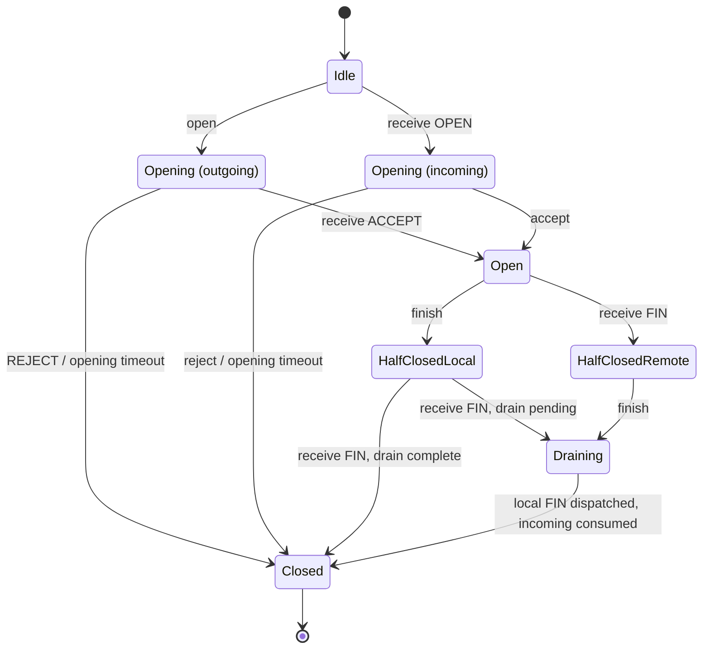

# Движок байтового потока

Документ описывает экспериментальный внутренний API `skvoz-core`.
Стабильные wire/FFI/IPC интерфейсы пока не определены.

## Модель и операции

Один `Stream` относится к одной сессии. Он не хранит сетевые идентификаторы;
драйвер обязан проверять identity/маршрутизацию до `receive`. Движок не
выполняет I/O, callbacks и фоновые задачи. Все вызовы последовательны,
через эксклюзивный mutable доступ.

- `open(metadata, now_ms)` начинает исходящее открытие и ставит OPEN.
- `receive(frame, now_ms)` валидирует фрейм и применяет его. Полученный OPEN в Idle создаёт входящую попытку и IncomingOpen.
- `accept(metadata)` / `reject(reason)` разрешены только для входящей попытки.
- `send(bytes)` возвращает `Accepted(n)` либо `WouldBlock`; возможна частичная отправка, остаток принадлежит вызывающему.
- `finish()` отмечает EOF локального отправителя, повтор идемпотентен.
- `consume_through(offset)` подтверждает непрерывно потреблённый префикс только уже выданных коннектору байтов. Повтор/устаревшее подтверждение ничего не меняет.
- `poll_frames(max_count)` передаёт владение исходящими фреймами драйверу; он обязан сохранить их порядок и ограничить собственные очереди.
- `poll_events(max_count)` передаёт владение событиями/буферами коннектору, поддерживает batch; 0 ничего не извлекает, один вызов выдаёт максимум 256 событий даже при большем max_count.
- `close(reason)` аварийно закрывает обе стороны и ставит CLOSE независимо от DATA-очереди; повтор ничего не меняет.
- `transport_lost()` закрывает локально без попытки отправить CLOSE по утраченному транспорту.
- `tick(now_ms)` проверяет opening deadline. Драйвер вызывает его регулярно и до операций коннектора; `receive` тоже проверяет время. Убывающее время/переполнение deadline — ошибка вызова.

Состояния: Idle, Opening (incoming/outgoing), Open, HalfClosedLocal, HalfClosedRemote, Draining (оба FIN, ожидается выдача/потребление данных), Closed. Во входящем Opening данные ещё недопустимы. Успешный accept переводит принимающий движок в Open; инициатор открывается только от ACCEPT. Очередь выдаёт ACCEPT раньше любого DATA.

## Диаграмма состояний

Схема показывает открытие и нормальное закрытие одного `Stream`.
Входящая и исходящая попытки открытия различаются направлением.



`drain complete` означает, что локальный FIN уже передан драйверу, исходящая
DATA-очередь пуста и все полученные байты потреблены. При получении второго FIN
поток может сразу перейти из HalfClosedLocal в Closed без наблюдаемого Draining.
Из любого незакрытого состояния возможен аварийный переход в Closed при
`close`, `transport_lost` или ошибке peer-протокола; эти переходы опущены для
читаемости. Closed терминален: late frames игнорируются, повторного открытия нет.

## Типизированные фреймы

| Фрейм | Поля / смысл |
| --- | --- |
| OPEN, ACCEPT | receive_window (u32), max_frame (u32), непрозрачные metadata. Объявляют лимиты приёма отправителя. |
| REJECT | Ограниченная непрозрачная причина. |
| DATA | offset (u64), непустые байты; offset первого DATA = 0. |
| WINDOW_UPDATE | consumed (u64), абсолютное число потреблённых байтов от начала направления. |
| FIN | final_offset (u64), точное число байтов направления до EOF. |
| CLOSE | Структурированная конечная причина. |

OPEN/ACCEPT валидируют положительное окно, `0 < max_frame <= receive_window`, верхние пределы и метаданные **до** копирования/изменения состояния. Один peer может иметь другие лимиты; send ограничивается меньшим local/remote max_frame. Экспериментальный сетевой формат описан в [wire.md](wire.md).

## Порядок и кредит

В каждом направлении движок хранит счётчики принятых к отправке, выданных транспорту, полученных, выданных коннектору и потреблённых байтов. Счётчики u64 не оборачиваются.

- DATA принимается только при `offset == received`; любой gap/duplicate — ProtocolError, никакой неограниченной reorder-очереди.
- FIN принимается только при `final_offset == received`. Повтор того же FIN идемпотентен; DATA после FIN недопустим.
- Кредит отправителя = объявленное peer окно минус (принятые к отправке − подтверждённые peer потреблённые). Резервирование происходит при send, не при poll_frames.
- WINDOW_UPDATE не может подтверждать больше байтов, чем уже выдано транспорту. Монотонный максимум подтверждения защищает от двойного/устаревшего кредитования.
- Получатель принимает не более `receive_window` непотреблённых байтов, включая уже выданные коннектору. `poll_events` не равен потреблению.
- `consume_through` не может превышать границу выданных Data. Коннектор обязан реально освободить соответствующие буферы; его копии и собственные очереди не являются памятью движка.
- WINDOW_UPDATE коалесцируется до последней границы; отдельное управляющее место обеспечивает прогресс даже при полной исходящей DATA-очереди.
- После WouldBlock переход к возможности send создаёт coalesced Writable. Движок не создаёт событие на каждое пополнение кредита.

## Буферы и численные пределы

| Параметр | Значение по умолчанию | Допустимый диапазон |
| --- | --- | --- |
| receive_window | 65 536 байт | 1…16 777 216 байт |
| max_frame | 16 384 байт | 1…65 536 байт, не больше окна |
| max_pending_frames | 64 DATA | 1…1 024 DATA |
| max_metadata | 4 096 байт | 0…65 536 байт |
| open_timeout_ms | 5 000 мс | положительный u64; сложение deadline проверяется |

При дефолтах внутренние полезные данные ≤ 65 536 + 64 × 16 384 + 3 × 4 096 = 1 126 400 байт на движок, плюс ограниченные структуры/allocator overhead. Три metadata-области — handshake frame и максимум два lifecycle event (IncomingOpen и Opened). Реализация может удерживать резервированный capacity после нормального drain; при закрытии освобождает byte queues. Эти числа **не являются пределом RSS процесса**, не включают кадры/события, уже переданные вызывающему, и не определяют глобальный бюджет множества потоков.

Метод проверки: snapshots occupancy/counters после каждого шага и тесты на наполненной очереди, все байты окна, множество однобайтовых DATA и Data, удерживаемые коннектором. Payload копируется только после проверки размера/кредита. Outgoing DATA имеет также предел количества, чтобы мелкие send не создавали неограниченные заголовки. Входящие DATA агрегируются в одном bounded byte buffer, а поллинг выдаёт chunks не больше max_frame.

Управляющее состояние конечно: один OPEN/ACCEPT, один накопительный WINDOW_UPDATE, один FIN, один аварийный terminal frame, flags lifecycle/Writable/RemoteFinished и один Closed. FIN выдаётся после всех ранее принятых DATA. CLOSE/REJECT заменяет непереданные DATA при аварийном прекращении.

## Закрытие, события и ошибки

FIN закрывает только отправляющее направление, противоположное может продолжать работу. RemoteFinished выдаётся после всех предыдущих Data в направлении, даже если они ещё не потреблены. Когда оба EOF известны, локальный FIN выдан транспорту и все входящие байты потреблены, движок переходит в Closed(Finished). Его событийный порядок — lifecycle, Writable, Data, RemoteFinished, Closed; соседние DATA могут агрегироваться.

Cancel, transport loss, protocol error и opening timeout отменяют непереданные/невыданные DATA и управляющие уведомления, очищают внутренние ресурсы и создают ровно один Closed. Abort может отбросить ещё не выданный IncomingOpen/Opened/RemoteFinished. Полученный REJECT создаёт Rejected и Closed(Rejected). Извлечённые ранее буферы остаются у вызывающего, но после abort consume недопустим. Late frames в Closed игнорируются, движок не переоткрывается; для новой сессии нужен новый экземпляр.

Некорректная операция локального API возвращает структурированную ошибку, сохраняя протокольное состояние. Некорректный удалённый фрейм возвращает ProtocolError, аварийно закрывает поток и ставит CLOSE(ProtocolError). Чужой/неаутентифицированный фрейм должен отсечь драйвер. Возобновление, liveness watchdog открытого потока, graceful shutdown драйвера и безопасность NATS находятся вне ответственности этого движка.

## Проверка

Semantic fixtures используют текстовые команды и hex payloads: другая
реализация может воспроизвести тот же сценарий. Они фиксируют поведение
движка. Бинарные wire vectors хранятся отдельно. Формат и тестовые данные:
[core/tests/fixtures](../core/tests/fixtures/README.md).

Из корня проекта:

```sh
cargo test -p skvoz-core --locked
python3 testbench/run.py check
```

Первый набор проверяет состояния, пределы и decoder; второй проверяет полный
путь через настоящий NATS. Ограниченный mutation smoke не заменяет длительный
fuzzing; глобальный бюджет памяти и production transport требуют отдельной реализации.
