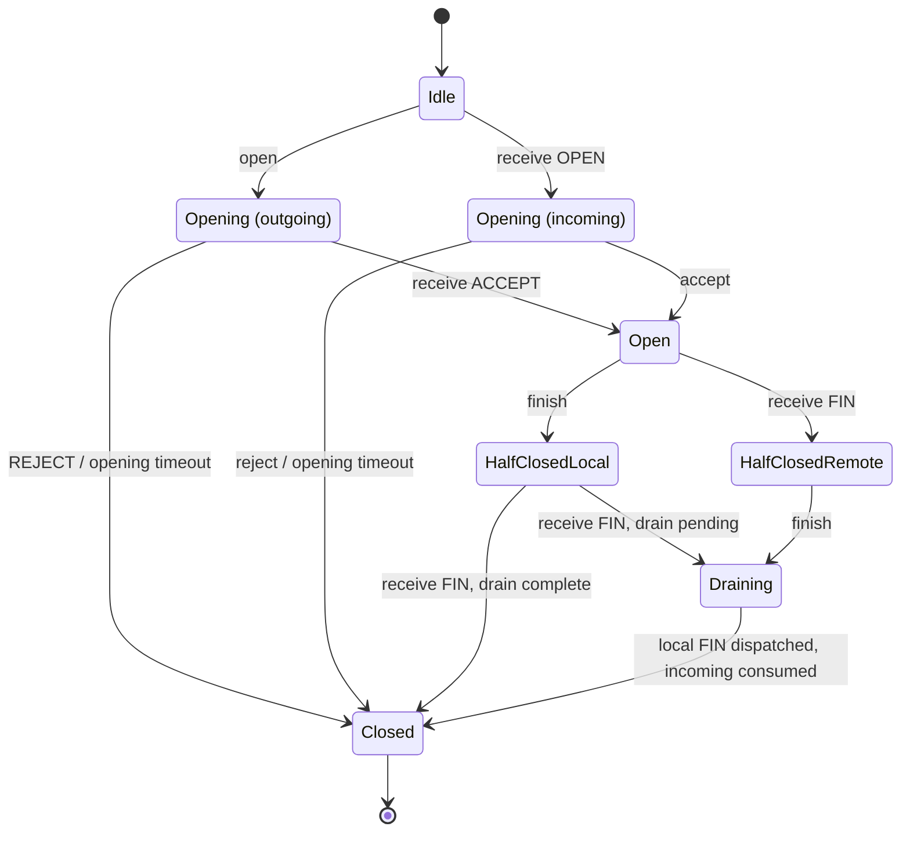

# Движок байтового потока

Документ описывает экспериментальный внутренний API `skvoz-core`.
Текущий контракт — Core 4.0.1 / wire 2; отдельные API/ABI описаны в страницах компонентов.

## Модель и операции

Один `Stream` относится к одной сессии. Он не хранит сетевые идентификаторы;
драйвер обязан проверять identity/маршрутизацию до `receive`. Движок не
выполняет I/O, callbacks и фоновые задачи. Все вызовы последовательны,
через эксклюзивный mutable доступ.

- `open(metadata, now_ms)` начинает исходящее открытие и ставит OPEN.
- `receive(frame, now_ms)` валидирует фрейм и применяет его. Полученный OPEN в Idle создаёт входящую попытку и IncomingOpen.
- `accept(metadata)` / `reject(reason)` разрешены только для входящей попытки.
- `send(bytes)` возвращает `Accepted(n)` либо `WouldBlock`; возможна частичная отправка, остаток принадлежит вызывающему.
- `finish()` отмечает EOF локального отправителя, повтор идемпотентен.
- `consume_through(offset)` подтверждает непрерывно потреблённый префикс только уже выданных коннектору байтов. Повтор/устаревшее подтверждение ничего не меняет.
- `poll_frames(max_count)` передаёт владение исходящими фреймами драйверу; он обязан сохранить их порядок и ограничить собственные очереди.
- `poll_events(max_count)` передаёт владение событиями/буферами коннектору, поддерживает batch; 0 ничего не извлекает, один вызов выдаёт максимум 256 событий даже при большем max_count.
- `close(reason)` аварийно закрывает обе стороны и ставит CLOSE независимо от DATA-очереди; повтор ничего не меняет.
- `transport_lost()` закрывает локально без попытки отправить CLOSE по утраченному транспорту.
- `tick(now_ms)` проверяет opening deadline. Драйвер вызывает его регулярно и до операций коннектора; `receive` тоже проверяет время. Убывающее время/переполнение deadline — ошибка вызова.

Состояния: Idle, Opening (incoming/outgoing), Open, HalfClosedLocal, HalfClosedRemote, Draining (оба FIN, ожидается выдача/потребление данных), Closed. Во входящем Opening данные ещё недопустимы. Успешный accept переводит принимающий движок в Open; инициатор открывается только от ACCEPT. Очередь выдаёт ACCEPT раньше любого DATA.

## Диаграмма состояний

Схема показывает открытие и нормальное закрытие одного `Stream`.
Входящая и исходящая попытки открытия различаются направлением.



`drain complete` означает, что локальный FIN уже передан драйверу, исходящая
DATA-очередь пуста и все полученные байты потреблены. При получении второго FIN
поток может сразу перейти из HalfClosedLocal в Closed без наблюдаемого Draining.
Из любого незакрытого состояния возможен аварийный переход в Closed при
`close`, `transport_lost` или ошибке peer-протокола; эти переходы опущены для
читаемости. Closed терминален: late frames игнорируются, повторного открытия нет.

## Типизированные фреймы

| Фрейм | Поля / смысл |
| --- | --- |
| OPEN, ACCEPT | receive_window (u32), max_frame (u32), непрозрачные metadata. Объявляют лимиты приёма отправителя. |
| REJECT | Ограниченная непрозрачная причина. |
| DATA | offset (u64), непустые байты; offset первого DATA = 0. |
| WINDOW_UPDATE | consumed (u64), абсолютное число потреблённых байтов от начала направления. |
| WINDOW_GRANT | consumed, limit, probe (u64): actual ACK и отдельная абсолютная граница кредита. |
| FIN | final_offset (u64), точное число байтов направления до EOF. |
| CLOSE | Структурированная конечная причина. |

OPEN/ACCEPT валидируют положительное окно, `0 < max_frame <= receive_window`, верхние пределы и метаданные **до** копирования/изменения состояния. Один peer может иметь другие лимиты; send ограничивается меньшим local/remote max_frame. Экспериментальный сетевой формат описан в [wire.md](wire.md).

## Порядок и кредит

В каждом направлении движок хранит счётчики принятых к отправке, выданных транспорту, полученных, выданных коннектору и потреблённых байтов. Счётчики u64 не оборачиваются.

- DATA принимается только при `offset == received`; любой gap/duplicate — ProtocolError, никакой неограниченной reorder-очереди.
- FIN принимается только при `final_offset == received`. Повтор того же FIN идемпотентен; DATA после FIN недопустим.
- Кредит отправителя = абсолютная объявленная граница минус принятые к отправке байты. WINDOW_UPDATE сдвигает границу на фактически потреблённый префикс, WINDOW_GRANT отдельно увеличивает окно. Резервирование происходит при send, не при poll_frames.
- WINDOW_UPDATE не может подтверждать больше байтов, чем уже выдано транспорту. Монотонный максимум подтверждения защищает от двойного/устаревшего кредитования.
- Получатель принимает не более `receive_window` непотреблённых байтов, включая уже выданные коннектору. `poll_events` не равен потреблению.
- `consume_through` не может превышать границу выданных Data. Коннектор обязан реально освободить соответствующие буферы; его копии и собственные очереди не являются памятью движка.
- WINDOW_UPDATE коалесцируется до последней границы; отдельное управляющее место обеспечивает прогресс даже при полной исходящей DATA-очереди.
- После WouldBlock переход к возможности send создаёт coalesced Writable. Движок не создаёт событие на каждое пополнение кредита.

## Буферы и численные пределы

| Параметр | Значение по умолчанию | Допустимый диапазон |
| --- | --- | --- |
| receive_window | 65 536 байт | 1…33 554 432 байт |
| max_frame | 16 384 байт | 1…65 536 байт, не больше окна |
| max_pending_frames | 64 DATA | 1…1 024 DATA |
| max_metadata | 4 096 байт | 0…65 536 байт |
| open_timeout_ms | 5 000 мс | положительный u64; сложение deadline проверяется |

Payload входящих и исходящих DATA хранится в отдельных chunks точной длины.
Пустой поток не выделяет receive payload; частично опустошенный chunk не
удерживает историческую ёмкость большого массива. `poll_events` передаёт
владение chunk без дополнительной копии. Буферы, уже переданные host, остаются
его ответственностью, включая буферы отменённого потока.

Record allowance направления — `min(receive_window / max_frame + 64, 65536)`.
Он ограничивает даже однобайтовые DATA. Конечные offsets отправленных DATA
сохраняются до actual ACK, полученных — до actual consumption, включая chunks,
переданные host. Отдельный предел `max_pending_frames` ограничивает непереданные
DATA. Один `send` принимает не более одного max_frame, поэтому host повторяет
вызов для оставшегося суффикса. Увеличение окна увеличивает allowance только
в пределах конечного backing; byte credit не позволяет обходить record credit.

При дефолтах полезные данные Stream ограничены receive_window плюс
`max_pending_frames × max_frame` и тремя metadata-областями; дополнительно
конечны chunk/end nodes и служебные события. Это предел внутренних ресурсов,
не RSS и не бюджет allocations, уже переданных вызывающему. Проверки включают
однобайтовые DATA, удержанные host chunks, byte/record exhaustion, u64 boundary
и actual ACK после извлечения frames/events.

Управляющее состояние конечно: один OPEN/ACCEPT, один накопительный WINDOW_UPDATE, один FIN, один аварийный terminal frame, flags lifecycle/Writable/RemoteFinished и один Closed. FIN выдаётся после всех ранее принятых DATA. CLOSE/REJECT заменяет непереданные DATA при аварийном прекращении.

## Закрытие, события и ошибки

FIN закрывает только отправляющее направление, противоположное может продолжать работу. RemoteFinished выдаётся после всех предыдущих Data в направлении, даже если они ещё не потреблены. Когда оба EOF известны, локальный FIN выдан транспорту и все входящие байты потреблены, движок переходит в Closed(Finished). Его событийный порядок — lifecycle, Writable, Data, RemoteFinished, Closed; DATA сохраняют границы исходных chunks.

Cancel, transport loss, protocol error и opening timeout отменяют непереданные/невыданные DATA и управляющие уведомления, очищают внутренние ресурсы и создают ровно один Closed. Abort может отбросить ещё не выданный IncomingOpen/Opened/RemoteFinished. Полученный REJECT создаёт Rejected и Closed(Rejected). Извлечённые ранее буферы остаются у вызывающего, но после abort consume недопустим. Late frames в Closed игнорируются, движок не переоткрывается; для новой сессии нужен новый экземпляр.

Некорректная операция локального API возвращает структурированную ошибку, сохраняя протокольное состояние. Некорректный удалённый фрейм возвращает ProtocolError, аварийно закрывает поток и ставит CLOSE(ProtocolError). Чужой/неаутентифицированный фрейм должен отсечь драйвер. Возобновление, liveness watchdog открытого потока, graceful shutdown драйвера и безопасность NATS находятся вне ответственности этого движка.

## Проверка

Semantic fixtures используют текстовые команды и hex payloads: другая
реализация может воспроизвести тот же сценарий. Они фиксируют поведение
движка. Бинарные wire vectors хранятся отдельно. Формат и тестовые данные:
[core/tests/fixtures](../core/tests/fixtures/README.md).

Из корня проекта:

```sh
cargo test -p skvoz-core --locked
python3 testbench/run.py check
```

Первый набор проверяет состояния, пределы и decoder; второй проверяет полный
путь через настоящий NATS. Ограниченный mutation smoke не заменяет длительный
fuzzing; полный предел RSS процесса и production transport требуют отдельных
измерений и проектирования.


## Менеджер множества потоков

`Manager` из той же crate — sans-I/O слой над Stream. Host регистрирует доверенный
`PeerId` через `register_peer(id, local_origin_bit)` и привязывает его к одной
аутентифицированной peer session. `StreamKey { peer, stream_id }` различает потоки
разных owners с одинаковым числовым ID. API использует ключ: `open(peer, metadata,
now_ms)`, accept/reject/send/finish/consume_through/close, `receive(key, frame,
now_ms)`, tick и batch poll. `RoutedFrame`/`ManagedEvent` возвращают ключ и payload.

| ManagerConfig | Default | Единица / смысл |
| --- | --- | --- |
| max_peers | 128 | Registered peers |
| max_streams | 8192 | Все live и closing entries |
| max_streams_per_peer | 128 | Entries одного peer |
| receive_budget | 67 108 864 | Байты обеспеченного aggregate peer credit |
| receive_budget_per_peer | 2 097 152 | Обещанные receive bytes одного peer |
| send_budget | 8 388 608 | Байты невыданных outgoing DATA |
| send_budget_per_peer | 262 144 | Невыданные outgoing DATA одного peer |
| stream | окно 8192, frame 1024, pending 8, metadata 256, timeout 5000 | Общая Config всех admitted streams |

Count admission отделён от byte credit: создание Stream проверяет peer/global
slots и metadata, без резервирования `slot count × maximum window`.
Config валидируется до создания Manager. Пустые streams не выделяют DATA.
Каждому зарегистрированному peer сначала выдаются до 64 KiB и 64 records,
обеспеченные суммарным pool, даже если DATA ещё не пришёл. В малом общем
pool начальное byte-разрешение автоматически уменьшается до
`max(receive_budget / max_peers / 8, 1)` с учётом stream/per-peer пределов,
сохраняя свободный backing для реальной активной потребности.

Manager использует два независимых ограничения DATA: per-stream permission и
aggregate peer permission. Сумма объявленных peer-разрешений не превышает
receive_budget, один peer ограничен receive_budget_per_peer. Record pool
вычисляется как `receive_budget / max_frame + max_peers × 64`; minima будущих
peers защищены отдельно. Сохранённые send-end nodes (pending и dispatched до
actual ACK) ограничены global/per-peer record budget независимо от send bytes.

При реальной потребности окна растут автоматически: начальные пробы, RTT и
фактический темп потребления определяют следующий запрос. Темп потока измеряется
с первого фактического потребления в текущей пробе: ожидание первого обслуживания
в общей очереди не считается медленной обработкой. Паузы между собственными
потреблениями при накопленной очереди продолжают сдерживать рост окна.
Полное освобождение полученных данных также разрешает рост: задержка обслуживания
нескольких соединений общим host не создаёт потолок окна при низком RTT.
Единственный активный поток использует доступный backing. Мало требующие peers не задают постоянный
потолок окна bulk-потока; несколько unmet consuming requests получают вращаемые
кванты свободного pool. Это прогресс и ограничение памяти, а не QoS или равные
скоростные квоты. Уже выданный неиспользованный кредит перераспределяется только
через упорядоченный FREEZE/FROZEN barrier из [wire](wire.md).

`send` резервирует bytes/records до копирования. `poll_frames` передаёт allocation
transport caller и освобождает pending send bytes; dispatched record metadata
сохраняется до actual ACK. Входящий DATA, даже для неизвестного/закрытого stream,
сначала проверяется aggregate ledger. Отбросить можно пришедшие bytes; отмена
потока не освобождает неиспользованное разрешение peer.

Ready peers и streams планируются вложенным round-robin, один frame на peer за
цикл. Control имеет отдельные coalesced slots, не требует DATA-кредита;
FROZEN не обгоняет ранее извлечённые DATA. Poll выдаёт максимум 256 элементов.
`Manager::poll_events_with_data_budget(max, admit)` проверяет целый следующий
DATA chunk до передачи владения. Callback учитывает суммарные admissions в
текущем batch; отказ оставляет DATA в Core и не блокирует обход других готовых
потоков. Число попыток ограничено `min(max, 256) + live_streams`; простаивающие
потоки не обходятся. Обычный `poll_events` разрешает все DATA.
Wake обработка ограничена 32 waiters. Opening deadlines индексированы;
полного сканирования idle streams на send/turn нет. `resources()` — явная
O(stream count) диагностика.

Terminal entry удаляется после выдачи всех событий/фреймов. High-water IDs
предотвращают повтор OPEN. `peer_lost` освобождает backing прежней authenticated
session и создаёт terminal events; host обязан их дренировать. `remove_peer`
допустим для failed peer без entries/rejection. Новая registration требует
новой session; old bytes не возобновляются. Переполнение счётчиков и deadline
barrier завершают только затронутую peer.

`metadata_backing()` консервативно учитывает receive/send records по 160 байт
(члены chunk/frame и двух end-node списков с allocator/alignment), каждый
`Entry` плюс 512 байт индексов/lifecycle и три max_metadata области, каждый
`Peer` плюс 512 байт control/index nodes, а также
`384 × (max_streams + max_peers)` байт для индексов unconsumed streams и
pressure deadlines. Transport и allocations, переданные
host, должны иметь независимые конечные бюджеты. Native network runtime
сохраняет резерв полного DATA chunk до полной записи или drop: отмена Core
не позволяет переиспользовать память ещё удерживаемого host буфера.

## Статический NatsNode

Feature `nats` экспортирует `nats::NatsNode`, `NatsConfig`, `PeerRoute` и
`FailureKind`. Host задаёт url/CA/credentials, namespace, local identity/session,
точные peer/session routes, queue capacities и per-turn limits. Для каждого
lifetime требуется новая generation. Routing envelope описан в [wire](wire.md).
Проверка CA, TLS и аутентификация обязательны по
[профилю транспорта](nats-runtime.md#профиль-транспорта); broker ACL должен разрешать
publish только с credential-bound sender и нужными recipient identities.

Subscription/client capacities — 1…65 536 сообщений/commands; input/output
per turn — 1…256 сообщений; io_timeout положителен. Namespace состоит из
непустых dot-separated tokens, token/session <=64 ASCII букв/цифр/`_`/`-`,
namespace <=256 байт. Duplicate/self peers отвергаются. Broker max_payload должен
поддерживать полный packet limit. NatsConfig не задаёт implicit credentials
или автоматический discovery.

`open/accept/reject/send/finish/consume_through/close` ставят работу; `turn(wait)`
передаёт bounded output batch, принимает bounded input и обрабатывает deadlines.
На пакет выполняется `flush`: в async-nats 0.50 он завершает локальную запись
буферов сокета, не подтверждая обработку брокером или потребление удалённой стороной.
`flush_pending()` передаёт один bounded output batch без inbound. `poll_events`
выдаёт terminal events и применяет async failure latch. Disconnect, overflow,
server/client error навсегда закрывают node при следующем owner turn/API/poll;
async-nats reconnect не возобновляет старые streams. `shutdown` завершает local
manager, unsubscribe и bounded NATS drain.

Отмена future `turn`/`flush_pending` во время publish/flush терминальна: после
передачи владения frame transport нельзя безопасно восстановить его порядок.
Drop guard защёлкивает ClientError; следующий owner API/poll применяет transport
loss. Отмена idle input wait безопасна. При externally cancelled relay host
должен продолжить terminal poll либо удалить node. Это не remote liveness или
гарантия доставки последнего CLOSE/FIN.

Peer routes статические: текущий NatsNode не заменяет session во время работы.
После restart клиента с новой session принимающую сторону нужно пересоздать
с новыми routes. Старые recipient subjects не достигают новой subscription,
неизвестный sender/session игнорируется; автоматический restart/rejoin отсутствует.

NATS очереди имеют message-count caps. Для Core publish/подписки грубая верхняя
оценка queued payload — capacity × 65 564 байта на очередь, плюс сообщения в
обработке; структуры, protocol/TLS/read buffers и NATS runtime accounting
не входят в Manager budgets. Broker configuration должна ограничивать payload
и доступ к этой subscription. Чужие subjects/payloads могут занять очередь до
проверки sender; authentication/ACL остаются обязательной границей доверия.
Это не полный предел RSS. [Нагрузочный режим](getting-started.md#нагрузочный-эксперимент)
показывает измеряемую область и её ограничения.

`Manager.aggregate()` возвращает счётчики потоков, резервирования, отправки и готовых очередей за постоянное время. `resources()` подробно просматривает буферы за O(число потоков). Жизненный цикл динамических сессий, ключи RuntimeKey с проверкой поколения и транспортные отметки определены в [контракте NATS runtime](nats-runtime.md) поверх того же Stream.
