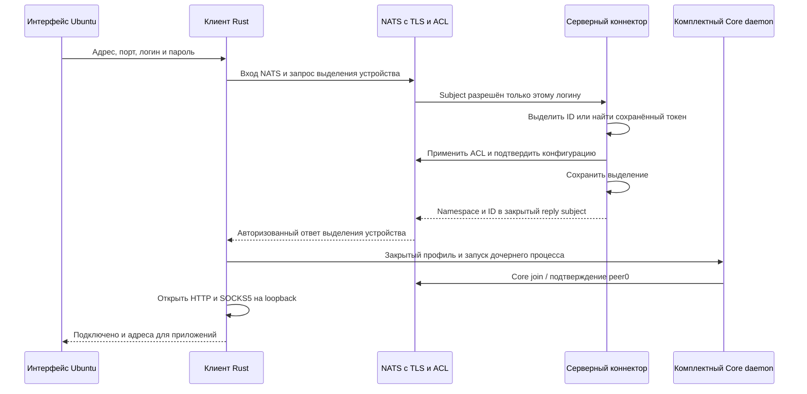

# Клиент Ubuntu

`skvoz-client` — нативное приложение Rust с GTK4/libadwaita для Ubuntu 24.04+
на amd64. Оно открывает локальные HTTP/HTTPS CONNECT и SOCKS5 CONNECT прокси,
управляет комплектным `skvoz-core-daemon` и передаёт TCP через удалённый NATS
к [серверному коннектору](server-connector.md). Rust и Python для запуска
установленного приложения не нужны. Это TCP-прокси: VPN/TUN, UDP и автоматическое
изменение системных настроек сети не реализованы.

## Установка и подключение

Загрузите `skvoz-client_<version>_amd64.deb` и соответствующий файл `.sha256`
из клиентского GitHub Release с тегом `ubuntu-v<version>` или проверочный
артефакт workflow **Ubuntu client**. В каталоге загрузки:

```sh
sha256sum -c skvoz-client_0.2.0_amd64.deb.sha256
sudo apt install ./skvoz-client_0.2.0_amd64.deb
```

Откройте **SKVOZ** из меню приложений. Введите IP-адрес или DNS-имя сервера,
внешний порт NATS, логин и пароль NATS. Для IPv6 допустимы `::1` и `[::1]`;
порт вводится в отдельное поле. Нажмите **Подключиться**.
Идентификатор устройства выделяется сервером автоматически; профиль и
`peer_id` вводить не требуется. Сервер должен поддерживать протокол выделения
устройств v1, описанный ниже. Старый сервер без него не подходит для этого входа.

Приложение проверяет TLS по системным доверенным корням и имени/IP сервера.
Оно не загружает CA по сети и не предоставляет режим обхода проверки TLS.
Сервер сначала отправляет NATS `INFO`, затем клиент устанавливает обязательный
проверенный TLS и передаёт учётные данные. Этот порядок одинаков для выделения
устройства и Core; переключателя нет. Начальный `INFO` содержит открытые
метаданные брокера; пароль и туннельные данные защищены TLS. Обновляйте клиент
и сервер совместно: прежние серверы с TLS-first несовместимы с новым клиентом.

Для частного сервера в настройках можно указать обычный PEM-файл CA,
полученный по доверенному каналу от администратора. Проверяются тип и размер
файла (1–65 536 байт); закрытая копия используется и для выделения устройства,
и для Core. Доверие публичному сертификату зависит от фактического сертификата
развёрнутого сервера; локальные проверки частного CA не доказывают работу
производственного ACME для публичного IP.

Пароль сохраняется после нажатия **Подключиться** и подставляется при следующем
запуске. Отключение и ошибки подключения не очищают поле. Сохранённый пароль
привязан к нормализованным адресу, порту и логину: при их изменении подставляется
пароль только соответствующего подключения. Пароли хранятся открытым текстом
в закрытом `settings.json` с правами `0600`, в каталоге `0700`; доступа к системному
хранилищу паролей не требуется. Набор системных библиотек GTK,
libadwaita, SVG-loader, доверенные CA, util-linux и procps устанавливаются через apt.

## Прокси для приложений

По умолчанию:

| Тип | Адрес потребителя |
| --- | --- |
| HTTP и HTTPS через CONNECT | `http://127.0.0.1:8080` |
| SOCKS5 CONNECT с DNS на сервере | `socks5h://127.0.0.1:1080` |

Порты меняются в **Настройках прокси** и сохраняются между запусками.
Допустимы разные порты 1024–65535; изменение во время подключения отклоняется.
Если один порт занят, подключение завершается с понятным сообщением, а уже
открытый второй listener закрывается. Слушатели доступны только на IPv4 loopback.
Прокси не требует локальной аутентификации и доступен любому процессу или пользователю этой машины. Проверка UID защищает только закрытый IPC, а не TCP listener. Это не изоляция приложений.

Например, после подключения:

```sh
curl --proxy http://127.0.0.1:8080 https://example.org/
curl --proxy socks5h://127.0.0.1:1080 https://example.org/
```

HTTP принимает абсолютный `http://host:port/path` и преобразует его в запрос
к назначению. Передаются тело и ответ; `Proxy-Authorization` и
`Proxy-Connection` не уходят на целевой сервис. Отправляется `Connection: close`:
один запрос на HTTP-соединение, без HTTP Upgrade и HTTP/2 proxy frontend.
Неоднозначная длина тела, повторный Host и указание полей маршрутизации/длины
в Connection отклоняются. HTTPS используется через CONNECT, без расшифровки
прикладного TLS. SOCKS5 поддерживает метод без локальной аутентификации и только
TCP CONNECT; BIND и UDP ASSOCIATE отклоняются. Доменные имена назначения
разрешаются сервером, не локальным прокси. Назначения проверяет серверная
политика: по умолчанию частные сети и localhost запрещены.

## Устройство, процессы и восстановление

Закрытые настройки в `$XDG_CONFIG_HOME/skvoz` (или `~/.config/skvoz`) содержат
адрес, логин, порты, путь CA и случайный 128-битный токен установки для каждой
пары endpoint/login, сохранённые пароли. Один экземпляр владеет эксклюзивной блокировкой
установки. Второй экземпляр не может создать новый Core с тем же устройством.
Копия настроек на другом компьютере копирует токен и сохранённые пароли: для отдельного устройства
нужно использовать его собственные настройки.

Клиент создаёт новый закрытый каталог внутри `$XDG_RUNTIME_DIR/skvoz-<uid>`
или системного каталога временных файлов в подкаталоге `skvoz-<uid>`, запускает дочерний daemon версии 1.3.0 и IPC v1,
проверяет готовность peer0, затем открывает прокси. Закрытый профиль с паролем
удаляется после готовности Core. При отключении сначала закрываются потоки,
затем собирается дочерний процесс и удаляется runtime-каталог. Linux-защита
от смерти родителя сохраняется после exec; проверка PID родителя закрывает
гонку запуска. Остатки после аварии удаляются только после проверки записанных
PID и времени старта прежних владельцев. Неизвестный или живой владелец,
недопустимый файл/сокет не удаляется автоматически.

Потеря Core, IPC или NATS закрывает текущие потоки. Восстановление с задержкой
1–15 секунд создаёт новое поколение Core только для новых соединений;
прерванные байты не возобновляются. Сохранившийся токен получает тот же ID.



## Протокол выделения устройства v1

Это управление коннектора, а не новый wire-протокол Core. После проверенного TLS
входа NATS клиент подписывается на точный
`skvoz.enroll.reply.<login>.<nonce>`, где nonce — 32 строчные шестнадцатеричные
цифры, и подтверждает подписку через PONG. Затем публикует request/reply
на фиксированный `skvoz.enroll.v1.<login>` с JSON не более 512 байт:

```json
{"v":1,"device":"00000000000000000000000000000000"}
```

Здесь нули — пример формата; клиент создаёт криптографический токен,
а сервер выделяет монотонный ID из существующего пула пользователя.
Брокер разрешает пользователю публиковать только запрос со своим литеральным
логином и подписываться только на его reply subjects. Сервер определяет логин
из subject, проверяет соответствие reply subject и точную схему JSON;
поле caller-supplied login, произвольный reply и повторные ключи не принимаются.

Ответ после подтверждённого применения ACL и записи состояния:

```json
{"v":1,"namespace":"skvoz.application","peer_id":2,"daemon":"1.3.0","ipc":1}
```

Повтор того же токена идемпотентен, включая потерянный ответ и перезапуск сервера.
Сервер сериализует выделение с административными изменениями и TLS-ротацией.
Core ACL разрешает только уже назначенные ID; ранее экспортированные профили
сохраняют доступ. Пул включает назначения через CLI и автоматические назначения;
первая выдача `user add` также занимает место. Общий пароль означает общий
доступ к назначенным ID данного логина, без взаимной изоляции его устройств.
Reset-password сохраняет назначения, а удаление логина отзывает весь его доступ.

Ошибки: `device_limit`, `overloaded`, `invalid_request`, `enrollment_failed`.
Очередь responder ограничена 16 запросами по 512 байт плюс один обрабатываемый
запрос; операция ограничена 15 секундами. Oversized payload, ограниченный NATS
до 65 588 байт, отбрасывается частями по 4096 байт. Повреждение управляющего
соединения восстанавливает только responder и не перезапускает чужие TCP-потоки.

## Границы ресурсов

Не более 62 локальных соединений суммарно, включая незавершённый HTTP/SOCKS
handshake. Два слота из 64 IPC owners зарезервированы для управления.
Handshake и открытие назначения ограничены 10 секундами; HTTP header —
16 384 байт. На поток работает одна очередь IPC: до 32 событий /
16 384 байт, включая событие, обрабатываемое коннектором. Независимое чтение
фреймов не останавливается при ожидании ответа команды; одновременно ожидается
не более одного ответа. Читаемый фрейм дополнительно ограничен 65 568 байтами.
Дополнительно daemon имеет собственную конечную очередь.
Командная очередь каждого владельца — 8 запросов, payload не более 1024 байт.
Core принимает фреймы до 1024 байт с окном приёма 8192 байта.

SEND сохраняет непринятый остаток и повторяет его после возможности отправки;
CONSUME подтверждает только байты, фактически записанные в сокет потребителя.
Отдельные направления сохраняют half-close: EOF запроса не отменяет ответ.
Медленный сокет не заставляет накапливать неограниченную память;
переполнение изолирует соответствующий IPC owner. Эти логические лимиты
не являются пределом RSS, гарантией CPU или оценкой числа пользователей сервера.

## Сборка и проверки

На Ubuntu 24.04 установите Rust 1.92, GTK4/libadwaita development packages,
`pkg-config`, GCC, Ruby 4.0.7/Bundler 4.0.22 и OpenSSL для проверок:

```sh
sudo apt install libgtk-4-dev libadwaita-1-dev pkg-config build-essential librsvg2-common
cargo build --release --locked -p skvoz-ubuntu-client -p skvoz-daemon
clients/ubuntu/packaging/build-deb.sh
cargo test --release --locked -p skvoz-ubuntu-client --lib
SKVOZ_UI_TEST=1 dbus-run-session -- xvfb-run -a cargo test --release --locked -p skvoz-ubuntu-client --test ui -- --nocapture
```

Для UI-проверки нужны `xvfb`, `xauth`, `dbus-x11` и GTK runtime; для реальной
процессной квалификации — NATS 2.15.0 и curl. Проверочный бинарник, включаемый
только feature `qualification`, не попадает в deb:

```sh
cargo build --release --locked -p skvoz-ubuntu-client --features qualification -p skvoz-daemon
(cd connectors/server && bundle install)
SKVOZ_INTEGRATION=1 \
SKVOZ_TEST_CORE="$PWD/target/release/skvoz-core-daemon" \
SKVOZ_TEST_CLIENT="$PWD/target/release/skvoz-client-test-driver" \
SKVOZ_TEST_NATS="$(command -v nats-server)" \
  sh -c 'cd connectors/server && bundle exec rspec ../../clients/ubuntu/spec'
```

Процессные fixtures используют обычные Ruby/RSpec helpers серверного компонента,
временные сертификаты, независимые приложение/daemon/NATS/server и реальных
HTTP, TLS CONNECT и SOCKS потребителей. Настоящая GUI-программа проверяется
отдельно в GTK main loop. Общая проверка `python3 testbench/run.py check`
проверяет Core/daemon/TCP/testbench без GUI-пакета и GTK development dependencies.

Workflow клиента компилирует только клиент и нужный daemon, собирает и проверяет
deb, сохраняет артефакт на 14 дней. Теги `ubuntu-v<version>` публикуют deb и SHA256;
сервер сохраняет собственные теги `v*`. Положительные path filters исключают
обычные client source/UI/package изменения из серверной сборки. Общие
`Cargo.toml`, `Cargo.lock`, Core/daemon и метаданные `clients/ubuntu/Cargo.toml`
затрагивают зависимые сборки. Серверному Docker-build достаточно этого manifest
и пустых Cargo targets: его образы не собирают клиент и не содержат GTK.
Реальное выполнение нового удалённого workflow и публикация Release проверяются
после публикации соответствующего изменения; локальная сборка этого не доказывает.
